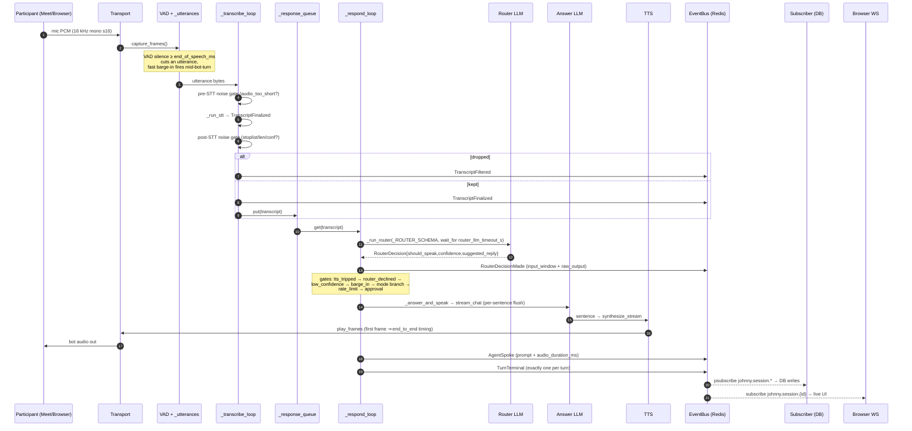
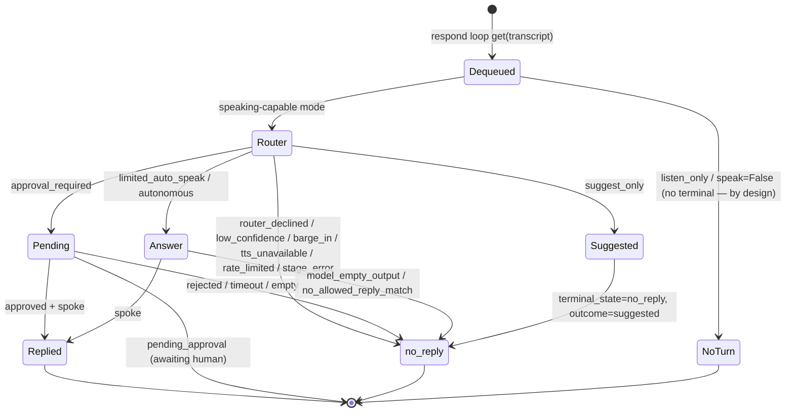
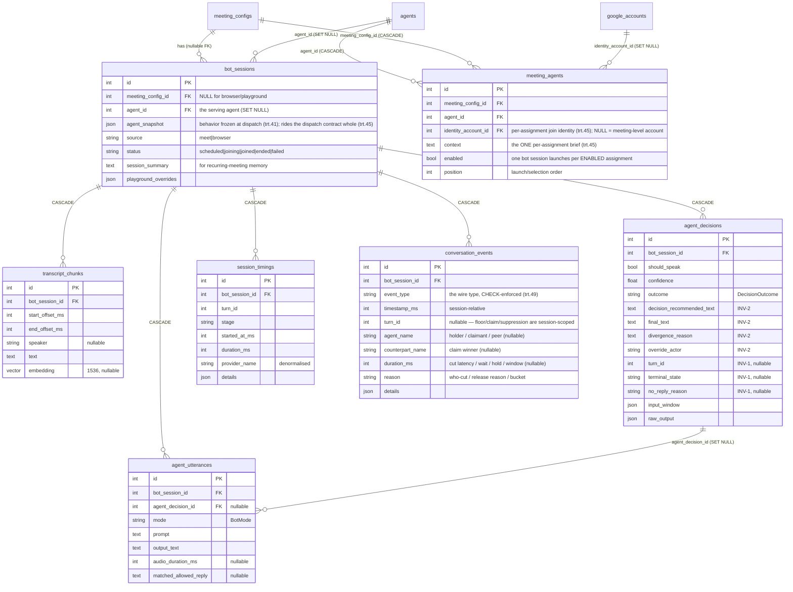

# Voice Pipeline — Technical Reference

This is the engineer-facing deep-dive into how Johnny turns meeting audio into
a spoken (or deliberately silent) reply, **as the code works today** — bugs,
optimistic shortcuts, and silent drops included. It is the companion to the
plain-language [PIPELINE_OVERVIEW.md](PIPELINE_OVERVIEW.md); read that first if
you want the story without class names.

Audience: an engineer or a future agent who needs to know what every component
does and exactly where to change it. Line numbers are **hints** (they drift);
the file path + class/function name is the stable anchor. When in doubt, open
the named file and grep the name.

Reads like [LATENCY.md](LATENCY.md) and [SETUP_LOCAL.md](SETUP_LOCAL.md), not
like the README. Dense, concrete, worked examples over prose.

> **⚠️ Retirement note (Johnny-n22).** The hand-rolled in-worker split
> orchestrator (the ~3.2k-LoC `the retired split engine`) was **retired**. The
> split STT→LLM→TTS path now runs on the **LiveKit-Agents `AgentSession` engine**
> under `backend/johnny/agent/` — for Meet sessions via the dispatched agent
> worker (`JOHNNY_ORCHESTRATOR=agentsession`, the default) and for the browser /
> playground in-process. Its transport-independent decision core (modes, the
> router/barge-in schemas + parsers, the noise-filter knobs) lives in
> `backend/johnny/voice_pipeline/reasoning.py`. No in-worker engine remains:
> the meet-worker is a pure audio bridge (`JOHNNY_ORCHESTRATOR=legacy` survives
> only as a break-glass join-and-capture mode). Sections 2–7 below describe the retired split
> engine's behavior **as a reference for what the AgentSession engine
> reproduces** (INV-1 / INV-2, the gates, the event/DB model) — its file/line
> anchors point into pre-retirement git history; for live code read
> `johnny/agent/` (orchestration) + `voice_pipeline/reasoning.py` (decision core).

> **Removed: the unified / S2S route (Johnny-trt.43, 2026-06-12).** The
> second pipeline shape — `UnifiedVoicePipeline`
> (`johnny/voice_pipeline/unified_pipeline.py`), the `s2s` provider kind with
> its `gemini-live` / `openai-realtime` / `stub` adapters
> (`app/providers/{s2s_base,gemini_live_s2s,openai_realtime_s2s,stub_s2s}.py`),
> the `pipeline_settings.pipeline_mode` singleton + `/providers/pipeline` API
> + the Split/Unified toggle on the /providers page,
> `SessionJobConfig.pipeline_mode` / `JOHNNY_PIPELINE_MODE`, the meet-worker's
> in-worker runner (`johnny/meet_worker/pipeline_runner.py`), the unified
> replay driver (`run_replay`), and the S2S interrupt harness
> (`johnny/e2e/interrupt/`) — was **removed from the product surface**: agents
> are born split-only and no half-working path ships. The last commit
> containing the code is
> `fc16a1e785595ff2fd1db6d60b56f07711c5ddae`; migration `0026` drops
> `pipeline_settings` and deactivates historical `kind='s2s'` provider rows
> (credentials preserved, never loaded). Re-introduction is deferred to epic
> **Johnny-20h**, redesigned as per-agent `RealtimeModel` adapters on the
> LiveKit `AgentSession` engine — not a revival of this in-worker pipeline.

> **One-line architecture.** The engine (the `AgentSession` pipeline) never
> writes the database directly. It publishes
> `PipelineEvent`s to a Redis `EventBus`; a single subscriber in the API worker
> (`session_status_subscriber.py`) is the **sole durable writer**, and the
> browser WebSocket (`api/ws.py`) is the live read path. Persistence and the UI
> are two independent consumers of the same event stream.

## Contents

1. [Two routes at a glance](#1-two-routes-at-a-glance) — now one route; see the S2S tombstone above
2. [High-level data flow](#2-high-level-data-flow) — sequence diagram
3. [Component reference](#3-component-reference)
4. [The router / decision layer](#4-the-router--decision-layer) — gates, modes, decision record
5. [Message + event shapes](#5-message--event-shapes)
6. [Storage](#6-storage) — tables, ER diagram, write timing
7. [Failure modes documented in code today](#7-failure-modes-documented-in-code-today)
8. [Cross-references](#8-cross-references)
9. [Verified livekit-agents 1.5.17 session surface](#9-verified-livekit-agents-1517-session-surface) — `say()` / `SpeechHandle`, roomless `user_state_changed`

---

## 1. Two routes at a glance

**There is one route now.** Every session — Meet and browser/playground alike
— runs the split STT → router LLM → answer LLM → TTS pipeline on the LiveKit
`AgentSession` engine. The second route this section used to compare against
(the unified / S2S pipeline, selected by the since-dropped
`pipeline_settings.pipeline_mode` singleton) was removed in **Johnny-trt.43**
— the tombstone at the top of this document records exactly what was deleted,
the pre-removal git SHA, and the deferred re-introduction epic (Johnny-20h:
per-agent `RealtimeModel` adapters on `AgentSession`).

Construction sites:

- **Meet sessions** — the dispatched agent worker builds the session from the
  job payload (`johnny/agent/job_runtime.py`); the meet-worker is a pure
  audio bridge into the session's LiveKit room.
- **Browser / playground sessions** — `app/services/browser_pipeline_runner.py::run_browser_pipeline`
  runs the same engine **in-process and roomless**
  (`johnny/agent/browser_session.py::BrowserAgentSession`, Johnny-7g5.1).

> **Migration note (epic Johnny-7g5).** The LiveKit `AgentSession` migration moves
> the **Meet** path off this in-process engine behind `JOHNNY_ORCHESTRATOR=agentsession`
> (a Meet-only flag — `session_scheduler` + `meet_worker/bootstrap`). The **browser /
> playground** path's **split** mode was migrated onto the `AgentSession` engine
> (Johnny-7g5.1) — run *in-process and roomless* via custom `AudioInput`/`AudioOutput`
> over `BrowserAudioTransport` (`johnny/agent/browser_audio_io.py`), with
> `feed_text → router gate → session.generate_reply()`. It does **not** read
> `JOHNNY_ORCHESTRATOR` and does **not** dispatch a remote agent worker (the engine
> runs in the API process). So the browser path no longer constructs the retired split engine.
> History:
> [playground-orchestration-deferral.md](playground-orchestration-deferral.md).

---

## 2. High-level data flow

### 2.1 Split route

The pipeline runs **two concurrent asyncio tasks** (the retired split engine,
the retired split engine L741): a *transcribe loop* that is never gated on the bot's
speak/think state (so participant audio always reaches `transcript_chunks` —
the Johnny-har contract) and a *respond loop* that drains finalised transcripts
in order. A bounded `asyncio.Queue` (`_response_queue`) bridges them; `None` is
the end-of-stream sentinel.



Every stage also emits a `PipelineTiming` event (`stt` / `router_llm` /
`answer_llm` / `tts` / `end_to_end` / `interrupt_*`) consumed by the subscriber
into `session_timings` and by the per-turn reasoning timeline in the UI.

### 2.2 Unified (S2S) route — removed

The unified route (raw frames forwarded to a single S2S provider session — no
VAD, no router, no modes, no terminal-state invariant) was removed in
**Johnny-trt.43** together with its sequence diagram and the split-vs-unified
divergence table that lived here. Read them in pre-removal git history
(`fc16a1e785595ff2fd1db6d60b56f07711c5ddae`); re-introduction is deferred to
epic **Johnny-20h** on the `AgentSession` `RealtimeModel` design.

---

## 3. Component reference

Each subsection: **source + entry point**, **inputs/outputs** (concrete types
from `events.py` / `app/providers/base.py`), **state owned**, **lifecycle**, and
**where its output surfaces** (logs + UI).

### 3.1 the retired split engine — the split orchestrator

- **Source:** the retired split engine (L626). Entry: `run()` (L741).
- **Inputs (constructor, L629):** `transport`, `vad`, `stt`, `router_llm`, `answer_llm`, `tts`, `event_bus`, `config: PipelineConfig`, and five optional sinks/gates (`decision_sink`, `utterance_sink`, `transcript_sink`, `approval_gate`, `transcript_history_loader`). All default to `Noop*`.
- **Outputs:** `PipelineEvent`s on the bus; audio frames to the transport.
- **State owned (in-memory, per session):** `_transcript_history: list[TranscriptFinalized]` (unbounded since Johnny-ckz.3), `_last_decision`, `_response_queue`, `_interrupt_event`, `_recent_utterance_times`, `_history_summary`, `_utterance_count`, barge-in bookkeeping (`_response_in_flight`, `_response_generation`, `_barge_in_tasks`, `_fast_barge_in_count`), per-turn anchors (`_transcript_turn_ids`, `_current_response_turn_id`, `_turn_started_at_ms`, `_end_to_end_emitted_for_turn`), the TTS circuit breaker `_tts_tripped`, and `_turn_terminal_emitted`. Nothing is persisted by the pipeline itself.
- **Lifecycle:** one instance **per session**, constructed by the meet-worker or browser runner; lives for the session; `run()` returns when the transport's capture stream ends.
- **Surfaces:** every decision/utterance/timing/terminal is an event → subscriber → DB → session detail UI + reasoning timeline (§3.14, §8).

`run()` also spawns the transcribe/respond tasks, drains in-flight barge-in
tasks on shutdown, and rehydrates history via the loader. Two text-injection /
control entry points worth knowing:

- `feed_text(text, speaker="user")` (L875) — the playground text path; builds a synthetic `TranscriptFinalized`, publishes + persists it, and enqueues it on `_response_queue`, bypassing VAD/STT. Returns `False` if the pipeline isn't running yet.
- `interrupt()` (L916) — sets `_interrupt_event` and calls `transport.cancel_playback()`; aborts **one** answer, not the session.

### 3.2 Transport — `JohnnyTransport`

- **Source:** `transport.py::JohnnyTransport` (ABC, L33). Selector: `create_transport_from_env` (L132) reads `JOHNNY_TRANSPORT` (default `local`; `SUPPORTED_TRANSPORTS = {local, livekit}`; anything else raises at startup).
- **Contract:** `sample_rate`, `start()`, `stop()` (idempotent), `capture_frames() -> AsyncIterator[bytes]`, `play_frames(frames, source_rate=None)`, `cancel_playback()` (default no-op). PCM is **16 kHz mono s16le** by default.
- **Implementations:**
  - `LocalAudioTransport` (L95) — thin wrapper over `MeetAudioBridge` (PulseAudio `parec`/`pacat`) in the meet-worker container. Constructed per-meeting.
  - `LiveKitTransport` (`livekit_transport.py` L99) — joins a LiveKit room; capture queue drops **oldest** frame on overflow (`DEFAULT_QUEUE_MAX_FRAMES=100` ≈ 2 s) to keep latency steady; resamples on playback.
  - `BrowserAudioTransport` (`browser_transport.py` L55, Johnny-ckz.6) — pure asyncio, does **not** own the WebSocket. Bounded `_capture_q` (200 frames ≈ 4 s, drops oldest), unbounded `_playback_q`, and a `_control_q` carrying `{"type":"interrupt","seq":N}` so the browser cancels already-scheduled `AudioBufferSourceNode`s (Johnny-ckz.13). `cancel_playback` drains the server queue synchronously and bumps `_interrupt_seq`.
- **State:** queues + interrupt seq (browser/livekit); none for local (delegates to bridge).
- **Lifecycle:** per-session; tied to the meeting container or the browser WS connection.

### 3.3 VAD — `VADAnalyzer`

- **Source:** `vad.py::VADAnalyzer` (ABC, L53). `DEFAULT_VAD_THRESHOLD = 0.5` (L28). Output: `VADResult{is_speech: bool, score: float}` (L41).
- **Implementations:** `EnergyVAD` (L78, RMS amplitude, stateless) and `SileroVAD` (L114, lazy-imports `silero-vad`+torch, expects 32 ms / 512-sample frames, stateful — `reset()` clears model state between utterances). The meet-worker tries `SileroVAD` first and falls back to `EnergyVAD(threshold=0.02)` on any exception (`pipeline_runner._build_vad`).
- **Used by:** the retired split engine (L949) — cuts an utterance after `end_of_speech_ms` consecutive silence frames and drives the fast barge-in counter.
- **Lifecycle:** per-meeting, reads `PipelineConfig.vad_threshold`. Stateful — never shared across concurrent streams.

### 3.4 STT — `STTProvider`

- **Source:** `app/providers/base.py::STTProvider` (ABC, L318). Single method `transcribe_stream(audio_iter) -> AsyncIterator[TranscriptEvent]`.
- **`TranscriptEvent`** (L130): `{text, is_final, timestamp_ms, confidence?, speaker?}`.
- **Driven by:** the retired split engine (L1941) — consumes the stream, keeps only `is_final` events, joins their text, and returns a single `TranscriptFinalized` (or `None` if no finals / empty text). Partial events are discarded here, which is the "partial-vs-final gate": the router only ever sees VAD-finalised, STT-finalised text (Johnny-arh).
- **Errors:** `STTError` has no category (all STT failures treated transient). A raise is caught in `_transcribe_and_emit` (L1144) → `error` timing + `PipelineStageFailed(stage="stt")` event, then the turn is skipped (session stays alive).
- **Lifecycle:** one instance per session from `load_active_providers`.

### 3.5 Router / Answer LLM — `LLMProvider`

- **Source:** `app/providers/base.py::LLMProvider` (ABC, L335). `chat(messages, tools?, response_format?) -> LLMResponse`; `stream_chat(messages) -> AsyncIterator[str]` (default yields the full `chat()` text as one delta so non-streaming adapters still satisfy the contract).
- **`LLMResponse`** (L173): `{text, finish_reason, tool_calls, structured_output, raw}`.
- **Gotcha — same instance for both roles.** Production wires `router_llm` **and** `answer_llm` to the **same** provider instance (`pipeline_runner.py::_assemble_pipeline` L515: `router_llm=llm, answer_llm=llm`). The two roles differ only by prompt + call: the router uses `chat(_ROUTER_SCHEMA)` (structured), the answer uses `stream_chat` (streamed). There is no way to point a different model at routing vs answering without a code change.
- **Surfaces:** router output → `RouterDecisionMade.raw_output` + `agent_decisions.raw_output`; answer prompt → `AgentSpoke.prompt` + `agent_utterances.prompt`; both rendered in the reasoning timeline (§8).

### 3.6 TTS — `TTSProvider`

- **Source:** `app/providers/base.py::TTSProvider` (ABC, L371). `synthesize_stream(text, voice_id?) -> AsyncIterator[bytes]` (16 kHz mono s16le).
- **Errors:** `TTSError` carries `category: TTSErrorCategory = Literal["quota_exceeded","auth_failed","rate_limited","unknown"]`. Terminal categories (`quota_exceeded`/`auth_failed`) trip the per-session **circuit breaker** `_tts_tripped` (§7); transient ones emit `AgentTTSFailed` but the next turn retries.
- **Driven by:** `_play_text_streamed` → `_tts_frame_iter` (L2227), which checks `_interrupt_event` before each frame (interrupt aborts within ~one frame ≈ 20 ms) and emits the per-turn `end_to_end` timing on the first audible frame.
- **Lifecycle:** per session. In listen-only / suggest-only modes (or after TTS degradation) the constructor receives a `_NoopTTS` stub whose `synthesize_stream` yields nothing.

### 3.7 EventBus

- **Source:** `event_bus.py::EventBus` (ABC, L33). `publish(event)`; `close()`. `DEFAULT_CHANNEL_PREFIX = "johnny.session"` (L30).
- **Implementations:** `InMemoryEventBus` (L44, test double, snapshot()) and `RedisEventBus` (L68) — publishes compact JSON (`event_to_dict` → `json.dumps`) to `johnny.session.<session_id>` (fallback `…unknown`). On publish failure it **logs and re-raises** (unlike the pipeline's `_emit_*` helpers which swallow).
- **Semantics:** plain pub/sub — late subscribers never see past events. Durability is the subscriber's job, not the bus's.
- **Lifecycle:** one per meeting container / browser runner.

### 3.8 Sinks — Decision / Utterance / Transcript

- **Sources:** `decision_sink.py`, `utterance_sink.py`, `transcript_sink.py`. Each defines an ABC + `Noop*` + `InMemory*` + a `SqlAlchemy*` variant.
- **`DecisionSink.record(...) -> int | None`** returns the persisted row PK (used by `approval_required` two-phase write); `update_outcome(decision_id, outcome)`. `DecisionOutcome = Literal["spoken","suppressed","pending","rejected","suggested"]`.
- **Critical fact — the `SqlAlchemy*Sink`s are dead in production.** the retired split engine (L653–654) defaults `decision_sink`/`utterance_sink` to `Noop*`, and **no production path constructs the SQLAlchemy variants** (grep: only test files + the never-wired `router_decisions.py::SqlAlchemyDecisionSink` / `agent_utterances.py::SqlAlchemyUtteranceSink`). The meet-worker image is deliberately ORM-free. **All `agent_decisions` / `agent_utterances` / `transcript_chunks` rows are written by the subscriber** (§3.14), driven off the event bus — not by the sinks. Don't waste time wiring the sinks for a browser/playground change.
- **Lifecycle:** per session; `Noop` in production.

### 3.9 ApprovalGate

- **Source:** `approval.py::ApprovalGate` (ABC, L45). `request_approval(ApprovalRequest) -> ApprovalOutcome = Literal["approved","rejected","timeout"]`.
- **Contract:** the pipeline guarantees `ApprovalPending` has been emitted before calling `request_approval`, so a gate only needs to *receive* the answer.
- **Implementations:** `NoopApprovalGate` (always `"timeout"` — safe default makes misconfiguration visible as auto-reject), `AsyncIOApprovalGate` (in-process future), `InMemoryApprovalGate` (scripted, tests). Production uses `app/services/approval.py::RedisApprovalGate` — subscribes to `johnny.approval.<session_id>`, resolves on `{"decision_id","action"}` messages from the API.
- **Wiring gotcha:** only the **meet-worker** wires `RedisApprovalGate`, and only for `approval_required` mode (`pipeline_runner._build_approval_gate`). **Browser sessions get `NoopApprovalGate`** → `approval_required` cannot work in the playground.

### 3.10 TranscriptHistoryLoader

- **Source:** `transcript_history.py::TranscriptHistoryLoader` (ABC, L37). `load(session_id, bot_session_id) -> list[TranscriptFinalized]`. `BOT_SPEAKER_LABEL = "Bot (you)"` (L22, Johnny-7qp) tags the bot's own prior lines so the LLMs can answer "what did you just say?".
- **Used by:** the retired split engine (L837) on `run()` start — seeds `_transcript_history` so a mid-session container respawn doesn't forget everything. Loader exceptions are logged and the run continues with empty history.
- **Wiring gotcha:** the meet-worker wires `HttpTranscriptHistoryLoader` **only when `JOHNNY_API_BASE_URL` is set**; otherwise `NoopTranscriptHistoryLoader` (no rehydration). Browser sessions get no loader.

### 3.11 Provider registry + loader

- **Sources:** `app/providers/base.py::ProviderRegistry` (L426, process-wide singleton via `get_registry()`) and `app/providers/loader.py::load_active_providers` (L42).
- **`ProviderKind`**: `STT | LLM | TTS` (the fourth `S2S` kind was removed in Johnny-trt.43). `load_active_providers` queries `provider_credentials WHERE is_active` scoped to the live kinds (one active row per kind, enforced by the partial unique index `uq_provider_credentials_active_per_kind`), decrypts credentials, and `instantiate`s a **fresh instance per call**. Kinds with no active row are absent from the result.
- **Surfaces:** denormalised `provider_name` on every `PipelineTiming` row (so the UI shows "TTS: 1.4 s — Local Piper" without a join).

### 3.12 Subscriber — the sole durable writer

See [§6](#6-storage) for the column-level writes; summarised here as a component.

- **Source:** `app/services/session_status_subscriber.py::run_subscriber` (L816), dispatched by `_apply_in_transaction` (L628). Started as a **daemon thread** with its own event loop from `app/worker.py::_start_status_subscriber_thread` (L294).
- **Input:** Redis `psubscribe johnny.session.*`. **Output:** rows in `bot_sessions`, `transcript_chunks`, `agent_decisions`, `agent_utterances`, `session_timings`, `conversation_events`.
- **Dispatch table** — branches on `payload["type"]`; **8 dispatch branches** (the conversation-events branch handles seven types), the rest silently dropped:

  | `type` | handler | table |
  |---|---|---|
  | `session_status_changed` | `apply_status_event` | `bot_sessions` (UPDATE) |
  | `transcript_finalized` | `apply_transcript_event` | `transcript_chunks` (INSERT) |
  | `router_decision_made` | `apply_router_decision_event` | `agent_decisions` (INSERT) |
  | `agent_spoke` | `apply_agent_spoke_event` | `agent_utterances` (INSERT) + `agent_decisions` (UPDATE) |
  | `pipeline_timing` | `apply_pipeline_timing_event` | `session_timings` (INSERT) |
  | `turn_terminal` | `apply_turn_terminal_event` | `agent_decisions` (UPDATE or synthetic INSERT) |
  | `transcript_filtered` | `apply_transcript_filtered_event` | `agent_decisions` (synthetic `no_reply` INSERT) |
  | `interruption_recorded` / `floor_acquired` / `floor_released` / `floor_expired` / `turn_claim_won` / `turn_claim_lost` / `peer_speech_suppressed` | `apply_conversation_event` | `conversation_events` (INSERT, Johnny-trt.49) |

  Published-but-never-persisted (reach the browser WS only): `agent_suggested`,
  `agent_tts_failed`, `pipeline_stage_failed`, `approval_pending`,
  `approval_resolved`. (The *suggestion itself* is still captured — the decision
  row carries `outcome=suggested` via the router/terminal path — but the
  `AgentSuggested` event has no DB branch.)
- **Lifecycle:** one daemon thread for the whole API-worker process. **If it crashes, it is not restarted** — all subsequent events are lost until the process restarts (§7).
- **Failure isolation:** browser sessions self-persist their terminal `bot_sessions` status inside the runner (the subscriber only runs in the worker process).

### 3.13 `UnifiedVoicePipeline` — the S2S route (removed)

Removed in **Johnny-trt.43** along with the `S2SProvider`/`S2SSession` ABCs
and the concrete adapters. The component reference that lived here is in
pre-removal git history (`fc16a1e785595ff2fd1db6d60b56f07711c5ddae`);
the deferred re-introduction (epic **Johnny-20h**) targets per-agent
`RealtimeModel` adapters on `AgentSession` instead of this class.

### 3.14 Where pipeline decisions surface in the UI

The session detail page (`frontend/src/routes/sessions/[id]/+page.svelte`) reads
the API serializers and assembles a per-turn view client-side (Johnny-ckz.28.4,
a pure derivation — no new tables):

- **`frontend/src/lib/sessionDetail.ts`** — TS types mirroring the serializers (`AgentDecisionRecord`, `AgentUtteranceRecord`, `SessionTimingRecord`) plus the operator-facing string maps. `NO_REPLY_REASON_LABEL` glosses each `NoReplyReason` ("a processing step failed", "filtered as background noise", …); `SESSION_TIMING_STAGE_LABEL` glosses each stage.
- **`frontend/src/lib/sessionTurns.ts`** — `assembleTurns(decisions, timingByTurn)` + `buildSteps` (the eight timeline steps), `classifyTurn`/`summarizeTurn`/`terminalLabel`, filter predicates. **Linkage keys:** decision↔timing by `turn_id`; utterance↔decision by `agent_decision_id`.
- **`frontend/src/lib/components/SessionTurnTimeline.svelte`** — renders the collapsed row (classification chip + `TERMINAL_LABEL` chip {Replied / Awaiting approval / No reply} + "Spoke instead" divergence badge + heard text + summary) and the expandable eight-step timeline with `done` / `skipped` / `missing` states.

Live updates ride the WS `handleDecision` / `handleAgentSpoke` /
`handleTurnTerminal` handlers off the same reactive state, so the timeline fills
in step-by-step during a live session.

### 3.15 Shared speech floor — multi-agent meetings (Johnny-trt.46)

When a meeting has more than one enabled agent assignment, the scheduler
launches one bot session per assignment (Johnny-trt.45) and the sessions
coordinate through `johnny/agent/speech_floor.py` with **no central
coordinator** — two invariants, both enforced peer-to-peer over Redis:

- **Never overlap.** The floor is a meeting-scoped Redis lock
  (`johnny:floor:lock:meeting:{id}`, `SET NX PX`) with a 10 s TTL renewed by
  a ~3 s heartbeat while held. EVERY speak path acquires it before its first
  audio frame and releases it when the speech completes or is interrupted:
  the reply path inside `run_turn`'s SPEAK fallthrough (released by
  `_on_reply_done`), ack/status/decline inside `_say_with_terminal`
  (released by `_on_say_done`), the trt.53 correction, and the Phase-5
  result deliverer (which also gains the floor *predicate*: `pop_ready` is
  never reached while a peer's lease is live). Acquisition waits up to 12 s
  (deliberately > TTL, so a waiter outlives a crashed holder); a turn-bound
  speech that still can't get the floor terminalizes
  `no_reply(floor_unavailable)` instead of overlapping. Reentrant within a
  session (an ack queued behind its own playing reply shares the hold), so
  the wait only ever blocks on a *peer's* speech. A crashed holder frees
  the floor within the TTL; an interrupted holder frees it from the
  done-callback immediately; `RouterGate.aclose` / `AgentRuntime.aclose`
  release anything stranded (`teardown`).
- **Never loop (strict v1).** Floor state is broadcast on
  `johnny:floor:meeting:{id}` (`acquired` / `heartbeat` / `released` /
  `spoke` frames). Each session tracks peers' floor *windows*
  (receiver-clock; hold + a 2 s post-release tail for STT latency) and, in
  `JohnnyAgent._gate_stt_events`, an STT final inside a peer's window is
  recorded into the transcript **labeled with the peer agent's name**
  (`TranscriptFinalized.speaker`) and dropped from the SDK stream — the
  turn never begins, the bot never responds to peer-bot speech
  (arbitration relaxes this deliberately in Johnny-trt.47). The `spoke`
  frames carry each release's spoken text as the **text-match backstop**:
  a final whose STT latency outran the tail still attributes to the peer
  when it matches recent published text (normalized; exact, or containment
  at ≥ 12 chars). Honest scope: no diarization — a human talking *during*
  a peer bot's window is attributed to the bot.

Per-assignment identity (trt.45) is what makes two sessions two
*participants*: each assignment joins as its own Google account
(`meeting_agents.identity_account_id`; the UI warns when two enabled
assignments share one). The scheduler gate is per assignment
(`pending_assignments`): a crashed co-agent redispatches alone while its
peers keep running, and `MAX_AGENTS_PER_MEETING` (4) is enforced with a
422 at assignment time and re-applied defensively at launch. Single-agent
sessions (every playground session — no `meeting_config_id`) build no
floor: speak paths ungated, zero floor events.

---

## 4. The router / decision layer

This is the part operators care about most: *why did the bot speak, or not?*

### 4.1 What the router emits

the retired split engine (L1971) calls `router_llm.chat(messages,
response_format=_ROUTER_SCHEMA)` bounded by
`asyncio.wait_for(router_llm_timeout_s)` (default 30 s — the session-14 fix).
`_ROUTER_SCHEMA` (L586) forces structured output:

| Field | Type | Meaning |
|---|---|---|
| `should_speak` | bool (required) | the single gate the pipeline acts on |
| `confidence` | number 0–1 (required) | clamped to `[0,1]` in `_parse_router_response`; compared to `confidence_threshold` |
| `reason` | string (required) | free-text rationale, shown in the decisions panel + "Understood this as" step |
| `reply_type` | string \| null | router's own classification label (free-form; `"string"`/`"answer"` are treated as no-ops by the UI classifier) |
| `suggested_reply` | string \| null | the router's candidate text → snapshotted to `decision_recommended_text` |

There is **no fixed category enum** — `should_speak` + `confidence` +
`reply_type` are the whole vocabulary. `_parse_router_response` (L3073) fails
**safe**: if the model returns no parseable dict, the decision becomes
`should_speak=False, confidence=0.0, reason="router returned no structured
output"` — a silent decline, no error event.

The router prompt (`_router_messages`, L2301) assembles, in order: a gating
system preamble, the `Bot (you):` speaker convention, `Mode:`, `Confidence
threshold:`, then any of `instructions` / `context` / `calendar event
description` / `calendar attachments` / `last session summary` / `allowed
replies`. The user message carries the rolling `Recent conversation:` window
(**only entries before the current transcript** — the concurrent-transcript
guard, §7), an optional `Earlier (summary):` line, the prior decision, and
`Latest transcript:`. The full snapshot is persisted to
`agent_decisions.input_window` for post-hoc reproduction.

### 4.2 Every gate / suppressor

Gates fire in this dispatch order. Two live in the transcribe loop (before the
router), the rest in `_respond_to_transcript_inner` (L1639). Each
response-loop suppressor persists the decision **and** emits exactly one
`TurnTerminal` (INV-1).

| # | Gate | Where (the retired split engine) | Outcome → `NoReplyReason` |
|---|---|---|---|
| — | Pre-STT audio floor (`audio_duration_ms < noise_filter_min_audio_ms`) | `_transcribe_and_emit` → `_is_audio_below_noise_floor` (L1125/L1242) | `TranscriptFiltered(audio_too_short)` — **no terminal** (never queued) |
| — | Post-STT noise gate (empty / punctuation-only / too-short / stoplist / low-confidence) | `_transcribe_and_emit` → `_classify_transcript_as_noise` (L1190/L1257) | `TranscriptFiltered(<reason>)` — **no terminal**; subscriber later writes a `noise_filtered` `no_reply` row |
| 1 | TTS circuit breaker tripped + `should_speak` | `_respond_to_transcript_inner` L1684 | `suppressed` → `tts_unavailable` |
| 2 | Router `should_speak=False` | L1698 | `suppressed` → `router_declined` |
| 3 | `confidence < confidence_threshold` | L1707 | `suppressed` → `low_confidence` |
| 4 | Barge-in fired during the router call | L1728 | `suppressed` → `barge_in` |
| 5 | `mode == suggest_only` | L1743 → `_handle_suggest_only` | `suggested` → `suggest_only` (terminal `no_reply`) |
| 6 | Rate limit hit | L1747 → `_is_rate_limited` | `suppressed` → `rate_limited` |
| 7 | `mode == approval_required` | L1768 → `_handle_approval_required` | depends on approval result |
| 8 | Answer stage: allow-list set, no match | `_answer_and_speak` L2069 | `suppressed` → `no_allowed_reply_match` |
| 8 | Answer stage: empty model output | `_answer_and_speak` L2075 | `suppressed` → `model_empty_output` |
| 9 | Any stage raised | `_respond_to_transcript` exception path L1549 | `suppressed` → `stage_error` |
| 9 | Belt-and-suspenders (no terminal emitted) | `_handle_unaccounted_turn` L1610 | `suppressed` → `stage_error` |

**Gates the bead asked about that do *not* exist:** there is no profanity
filter and no "thinking" cooldown. "Partial-vs-final" is handled implicitly —
`_run_stt` keeps only `is_final` STT events, so the router never sees partials.

**Barge-in** has two paths (both gated on `enable_barge_in` ∧ speaking mode ∧
`_response_in_flight`): a **fast VAD path** (`_utterances` → `_fire_fast_barge_in`,
fires `interrupt()` within ~200 ms of `barge_in_min_speech_ms` of speech) and a
**slow classifier** (`_maybe_barge_in` → `_classify_barge_in_intent`, a bounded
LLM call with `_BARGE_IN_SCHEMA`, fails open on timeout). A `_response_generation`
guard stops a stale classifier verdict from aborting a later, unrelated answer.

### 4.3 The mode matrix

`PipelineConfig.mode` is one of five strings; the legacy `speak=False` flag is
equivalent to `listen_only` for router-skip. Set memberships (L299–335):
`NON_SPEAKING_MODES = {listen_only, suggest_only}`, `SPEAKING_MODES =
{approval_required, limited_auto_speak, autonomous}`, `FREE_FORM_MODES =
{autonomous}`.

| Gate / stage | `listen_only` | `suggest_only` | `limited_auto_speak` (default) | `approval_required` | `autonomous` |
|---|---|---|---|---|---|
| Enters response loop | **no** — returns pre-router, no terminal | yes | yes | yes | yes |
| Router LLM | skipped | runs | runs | runs | runs |
| `should_speak` / `confidence` / `barge_in` gates | n/a | apply | apply | apply | apply |
| Mode branch | n/a | `_handle_suggest_only` | falls through | `_handle_approval_required` | falls through |
| Rate limit | n/a | not reached | only if `allowed_replies` set | not reached | always checked |
| Allow-list enforcement | n/a | n/a | `_select_allowed_reply` if set | `_select_allowed_reply` if set (post-approval) | **bypassed** (FREE_FORM) |
| Approval round | n/a | n/a | none | `ApprovalGate.request_approval` | none |
| Answer LLM + TTS | skipped | skipped | yes | yes (post-approval) | yes |
| Terminal on success | n/a | `no_reply` / `suggested` | `replied` / `spoken` | `replied` / `spoken` | `replied` / `spoken` |

Notes worth internalising:

- **`listen_only` and `speak=False` are the only paths that emit no terminal** — by design, INV-1 scopes to turns that *could* get a reply (`_respond_to_transcript` L1499–1505). The `listen_only` `NoReplyReason` value therefore never originates here.
- **`suggest_only` exits before the rate-limit check**, so rate limiting never applies to it even with `allowed_replies` set.
- **`autonomous` silently ignores `allowed_replies`** — `use_allowlist = bool(allowed_replies) and mode not in FREE_FORM_MODES` (L2062). The router prompt still shows the list, but the answer streams free-form.
- **Rate limiting is off by default** — `DEFAULT_RATE_LIMIT_MAX_UTTERANCES = 0` (disabled). The `DEFAULT_AUTONOMOUS_RATE_LIMIT_MAX_UTTERANCES` constant exists but is not wired to a separate autonomous path; `_is_rate_limited` reads one `rate_limit_max_utterances` for all modes.
- **TTS degradation:** if a `SPEAKING_MODES` session has no TTS provider, the runner downgrades it to `suggest_only` at assembly time (`pipeline_runner` L472) so the router never approves a reply that can't be played (the Johnny-vgl symptom).

### 4.4 The per-turn lifecycle (state machine)

INV-1 (Johnny-ckz.28.3): every transcript the response loop dequeues resolves to
**exactly one** terminal state, emitted through the single chokepoint
`_emit_turn_terminal` (L1561). `_respond_to_transcript` resets
`_turn_terminal_emitted=False` per turn and has a belt-and-suspenders fallback
(`_handle_unaccounted_turn`) plus an exception-path terminal, so a turn can
never vanish.



The three coarse terminal states (`replied` / `pending_approval` / `no_reply`)
are the operator-facing buckets; the finer `DecisionOutcome` (`spoken` /
`suppressed` / `pending` / `rejected` / `suggested`) is the audit detail. The
optimistic `outcome` is assigned at **router time** and demoted later if the
turn actually said nothing (§4.5, §6).

### 4.5 The decision record shape (canonical per-turn row)

INV-2 (Johnny-ckz.28.2): the **`agent_decisions` row is the single canonical
per-turn record** — not a separate table. The columns the decision layer reads
and writes:

| Column | Written by | Meaning |
|---|---|---|
| `should_speak` / `confidence` / `reason` / `reply_type` / `suggested_reply` | `apply_router_decision_event` (router time) | raw router output |
| `decision_recommended_text` | router time (= `suggested_reply` snapshot) | **what the bot planned to say** — read by the decisions panel |
| `final_text` | `apply_agent_spoke_event` (speak time) | **what was actually spoken** (= the utterance's `output_text`) — read by the chat |
| `divergence_reason` + `override_actor` | speak time, **only when** the two texts differ | who rewrote the text (`answer_llm` / `allowlist`) + why → "Spoke instead" badge |
| `outcome` | router time (optimistic), demoted by `turn_terminal` | fine-grained `DecisionOutcome` |
| `turn_id` | router time | binds the row to its `TurnTerminal` + `session_timings` rows |
| `terminal_state` + `no_reply_reason` | `apply_turn_terminal_event` | coarse bucket + suppressor name |
| `input_window` / `raw_output` | router time | full router prompt + raw LLM response (reasoning timeline) |

Parity is enforced centrally by **one ORM mapper event**,
`_agent_decision_parity_guard` (`before_insert`/`before_update` on
`AgentDecision`, `models.py` L628): it rejects (a) `terminal_state=no_reply`
without a `no_reply_reason`, and (b) a `final_text` that diverges from
`decision_recommended_text` (whitespace-normalised by `decision_texts_diverge`)
without **both** `override_actor` and `divergence_reason`. Because it's a mapper
event, **every ORM write path is covered** without each re-implementing the
check; a `DecisionParityError` (a `ValueError`) aborts the flush and the whole
event is dropped + logged. Raw-SQL migrations bypass the guard (no ORM flush) —
which is how the 0018 backfill can stamp diverging legacy text.

---

## 5. Message + event shapes

Every event is a frozen `@dataclass` in
`backend/johnny/voice_pipeline/events.py`, carries `timestamp_ms` (monotonic
offset from session start) + optional `session_id`, and is serialised to JSON by
`event_to_dict` (`dataclasses.asdict`). `PipelineEvent` is the union of all of
them (the 12 originals + the task lifecycle events + the seven
conversation-dynamics events, Johnny-trt.49).

| Event (`type` string) | Key fields | Emitted by | Persisted? | UI surface |
|---|---|---|---|---|
| `TranscriptFinalized` (`transcript_finalized`) | `text, speaker?, confidence?` | STT finals | ✅ `transcript_chunks` | transcript pane; WS type → `transcript_final` |
| `TranscriptFiltered` (`transcript_filtered`) | `text, reason: TranscriptFilteredReason, audio_duration_ms?` | `_publish_noise_filtered` | ✅ synthetic `no_reply` decision (except `audio_too_short`) | activity log / "No reply — filtered as background noise" |
| `RouterDecisionMade` (`router_decision_made`) | `should_speak, confidence, reason, reply_type?, suggested_reply?, input_window, raw_output, turn_id?` | `_respond_to_transcript_inner` | ✅ `agent_decisions` | decisions panel; WS type → `router_decision` |
| `AgentSpoke` (`agent_spoke`) | `text, audio_duration_ms, matched_allowed_reply?, prompt` | `_answer_and_speak` | ✅ `agent_utterances` (+ updates decision) | chat line |
| `AgentSuggested` (`agent_suggested`) | `suggested_reply, decision_id?, reason, reply_type?` | `_handle_suggest_only` | ❌ (decision row carries `outcome=suggested`) | suggestion notification (live WS only) |
| `AgentTTSFailed` (`agent_tts_failed`) | `provider_name?, category: AgentTTSFailedCategory, message, terminal` | `_respond_loop` TTSError handler | ❌ | playground diagnostics (live WS only) |
| `PipelineStageFailed` (`pipeline_stage_failed`) | `stage: stt\|router_llm\|answer_llm, category, message, provider_name?` | `_emit_stage_failed` | ❌ | playground diagnostics (live WS only) |
| `SessionStatusChanged` (`session_status_changed`) | `status: SessionStatus, error_reason?` | meet-worker bootstrap | ✅ `bot_sessions` | calendar/session status; WS type → `session_status_change`; only type forwarded to `/ws/global` |
| `ApprovalPending` (`approval_pending`) | `decision_id, suggested_reply, timeout_s, reason, reply_type?` | `_handle_approval_required` **and** the subscriber | ❌ (the `pending` decision row is the durable record) | approval card / push (live WS) |
| `ApprovalResolved` (`approval_resolved`) | `decision_id, resolution: approved\|rejected\|timeout` | `_handle_approval_required` + API | ❌ | clears the approval card (live WS) |
| `PipelineTiming` (`pipeline_timing`) | `turn_id, stage: PipelineTimingStage, started_at_ms, duration_ms, provider_name?, details` | `_emit_timing` | ✅ `session_timings` | per-turn activity log / reasoning timeline |
| `TurnTerminal` (`turn_terminal`) | `turn_id, terminal_state: TerminalState, outcome, no_reply_reason?, detail` | `_emit_turn_terminal` | ✅ stamps/creates `agent_decisions` | terminal chip + "Final decision" step |
| `InterruptionRecorded` (`interruption_recorded`) | `who: InterruptionWho, cut_latency_ms?, speech_kind, turn_id?, partial_kept` | `RouterGate` interrupted settle paths (every cut speech: reply / ack / status / correction / task result, Johnny-trt.49) | ✅ `conversation_events` | activity log row + turn-header barge-in badge with cut latency |
| `FloorAcquired` (`floor_acquired`) | `holder, wait_ms` | trt.46 shared speech floor (vocabulary shipped ahead of the emitter) | ✅ `conversation_events` | activity log "Session" group |
| `FloorReleased` (`floor_released`) | `holder, hold_ms, reason` | trt.46 shared speech floor | ✅ `conversation_events` | activity log "Session" group |
| `FloorExpired` (`floor_expired`) | `holder, hold_ms` | trt.46 floor TTL lapse (crash safety) | ✅ `conversation_events` | activity log "Session" group |
| `TurnClaimWon` (`turn_claim_won`) | `bucket, claimant, contenders` | trt.46/47 turn arbitration | ✅ `conversation_events` | activity log "Session" group |
| `TurnClaimLost` (`turn_claim_lost`) | `bucket, claimant, winner, contenders` | trt.46/47 turn arbitration | ✅ `conversation_events` | activity log "Session" group |
| `PeerSpeechSuppressed` (`peer_speech_suppressed`) | `peer, window_ms, text_match_hits` | trt.46 peer-awareness loop rule | ✅ `conversation_events` | activity log "Session" group |

**Conversation dynamics (Johnny-trt.49).** The last seven rows are the
conversation-dynamics vocabulary — interruptions and "all those small
actions" persisted for post-hoc analysis. `InterruptionRecorded` is live
today on every surface: the gate consults its `InterruptionMonitor`
(`johnny/agent/interruptions.py` — fed user speech edges from
`user_state_changed` in `JohnnyAgent.on_enter`, and stop requests from
`BrowserAgentSession.interrupt()`) at every `handle.interrupted` settle, so
`who` distinguishes a participant talking over the bot (`user_over_bot`)
from an explicit stop (`bot_cut_by_stop`) and `cut_latency_ms` measures
speech-onset → audio-stop (`None` when nothing observed explains the cut).
The floor + suppression events are live in multi-agent meetings since
Johnny-trt.46 (`johnny/agent/speech_floor.py`, §3.15): the *holder* emits
`FloorAcquired`/`FloorReleased`; an *observer* emits `FloorExpired` (a
peer's lease lapsed without release — crash) and `PeerSpeechSuppressed`
(one per closed peer window that suppressed transcripts). The claim events
await turn arbitration (Johnny-trt.47). Single-agent sessions never emit
any of the five. `timestamp_ms` is session-relative like
`PipelineTiming.started_at_ms`.

**Wire-type remapping** (`api/ws.py::WIRE_TYPE_MAP`): `transcript_finalized →
transcript_final`, `router_decision_made → router_decision`,
`session_status_changed → session_status_change`; all other types pass through.
Every outbound WS frame is `{seq, type, …flattened payload}`; the client can
resume with `?since_seq=N`.

**Enum literals** (the operator-meaningful ones):

- `TerminalState` = `replied | pending_approval | no_reply`.
- `NoReplyReason` (wire, `events.py` L41) — **13 values**: `router_declined`, `low_confidence`, `barge_in`, `rate_limited`, `tts_unavailable`, `suggest_only`, `approval_rejected`, `model_empty_output`, `no_allowed_reply_match`, `noise_filtered`, `stage_error`, `listen_only`, `floor_unavailable` (trt.46 — a peer agent kept the speech floor past the acquire wait). The DB + frontend enums add a 14th, `legacy` (backfill-only).
- `TranscriptFilteredReason` = `audio_too_short` (pre-STT) | `empty` | `punctuation_only` | `too_short` | `stoplist_match` | `low_confidence` (post-STT).
- `PipelineTimingStage` = `stt | router_llm | answer_llm | tts | end_to_end | interrupt_fast | interrupt_slow | provider_switch | error`.
- `AgentTTSFailedCategory` = `quota_exceeded | auth_failed | rate_limited | unknown` — **deliberately redeclared** in `events.py` (not imported from `app.providers.base.TTSErrorCategory`) so the meet-worker package imports without `app` on `sys.path`; keep the two in manual lock-step.

**Dev-only / not-yet-persisted events** (live WS only, no DB branch):
`AgentSuggested`, `AgentTTSFailed`, `PipelineStageFailed`, `ApprovalPending`,
`ApprovalResolved`. To make any of these durable you must add **both** the event
*and* a subscriber dispatch branch (§3.12).

---

## 6. Storage

All pipeline tables are SQLAlchemy models in `backend/app/db/models.py`; enums
are `StrEnum` stored as `VARCHAR` + CHECK (no native PG enums). The subscriber
(§3.12) is the only writer in production.

### 6.1 ER diagram



There is **no `approvals` table** — the approval round is Redis-only
(`johnny.approval.<id>`); the `agent_decisions` row with `outcome=pending` *is*
the durable approval record.

### 6.2 Tables + write timing

**`transcript_chunks`** (added 0001) — one INSERT per kept `TranscriptFinalized`,
in `apply_transcript_event`. Columns: `bot_session_id`, `start_offset_ms`,
`end_offset_ms` (both set to the event `timestamp_ms` on the subscriber side —
the event carries no duration), `speaker?`, `text`, optional `embedding`
(`vector(1536)`, populated later for semantic search). Append-only (no
`updated_at`).

**`agent_decisions`** (0001; parity cols 0018; terminal cols 0019) — the
canonical per-turn record. Three write moments:

1. **Router time** (`apply_router_decision_event`, INSERT): writes the raw router fields, snapshots `decision_recommended_text = suggested_reply`, sets `turn_id` + `input_window` + `raw_output`, and pre-assigns `outcome` **optimistically** from `input_window["mode"]`:
   `should_speak=False → suppressed`; `approval_required → pending` (and `terminal_state=pending_approval`); `suggest_only → suggested`; `limited_auto_speak`/`autonomous` → **`spoken`** (before the answer/TTS even run); unknown/`listen_only` → `suppressed`.
2. **Speak time** (`apply_agent_spoke_event`, UPDATE): sets `final_text`, flips a `pending` row to `spoken`, and on whitespace-normalised divergence stamps `override_actor` (`allowlist` if `matched==text` else `answer_llm`) + `divergence_reason`, logging `decision.override: …`.
3. **Terminal time** (`apply_turn_terminal_event`, UPDATE or synthetic INSERT): stamps `terminal_state` + `no_reply_reason`, and **demotes** the optimistic `outcome` to what actually happened. If no decision row exists for the `turn_id` (router crashed before emitting `router_decision_made` — the session-14 silent drop), it **creates** one so the turn is still accounted for. `transcript_filtered` likewise creates a synthetic `no_reply`/`noise_filtered` row (except `audio_too_short`).

**`agent_utterances`** (0001) — one INSERT per `AgentSpoke`, in
`apply_agent_spoke_event`. Columns: `bot_session_id`, `agent_decision_id?` (the
FK resolved by a **most-recent `should_speak=True` scan**, not a `turn_id`
match — a known race if two such decisions are in flight), `mode`, `prompt`,
`output_text`, `audio_duration_ms?`, `matched_allowed_reply?`.

> **Playground mode mislabel (live bug).** `mode` is read from
> `BotSession.meeting_config.mode` at flush time and **defaults to
> `BotMode.LISTEN_ONLY` when the session has no meeting_config**. Browser /
> playground sessions have `meeting_config_id = NULL` and run `autonomous` by
> default, but their `AgentSpoke` event carries no mode — so every persisted
> playground utterance is stamped `mode=listen_only` regardless of the mode the
> pipeline actually ran. The runtime mode is correct; only the persisted
> `agent_utterances.mode` column is wrong.

**`session_timings`** (added 0008) — append-only INSERT per `PipelineTiming`.
Columns: `bot_session_id`, `turn_id`, `stage` (whitelisted to the 9
`PipelineTimingStage` values; unknown stages dropped with a WARN to avoid CHECK
violations), `started_at_ms`, `duration_ms`, `provider_name?` (denormalised),
`details` JSON. Composite index `(bot_session_id, turn_id, started_at_ms)`.

**`conversation_events`** (added 0029, Johnny-trt.49) — append-only INSERT per
conversation-dynamics event, in `apply_conversation_event`. The durable
analysis record for interruptions / floor handoffs / turn claims /
peer-speech suppression; queryable per meeting via
`bot_sessions.meeting_config_id`. `event_type` stores the wire `type`
verbatim (CHECK `ck_conversation_events_event_type`); the headline metric
(cut latency / floor wait / hold / suppression window) lands in
`duration_ms`, agent attribution in `agent_name`/`counterpart_name`, who-cut
or the release reason or the contended bucket in `reason`, everything else
in `details` — the full per-type mapping is on the ORM model
(`app.db.models.ConversationEvent`). Index `(bot_session_id, timestamp_ms)`.
Served by `GET /sessions/{id}/conversation_events` and included in the
history export.

**`bot_sessions`** (0001; `source`+`playground_overrides`+nullable
`meeting_config_id` 0007; `session_summary` 0013; `bot_name` 0016) — UPDATEd by
`apply_status_event` on lifecycle transitions. Browser sessions self-persist
their terminal status from the runner (the subscriber runs only in the worker
process).

**`pipeline_settings`** (0009) — the singleton split/unified toggle. **Dropped
by migration 0026** (Johnny-trt.43): nothing reads it since the S2S route was
removed.

### 6.3 Enums

- **`DecisionOutcome`** (`spoken | suppressed | pending | rejected | suggested`; `suggested` added 0003). CHECK `ck_agent_decisions_outcome`.
- **`TerminalState`** (0019): `replied | pending_approval | no_reply`; `terminal_state_for_outcome()` maps `spoken→replied`, `pending→pending_approval`, everything else → `no_reply`. Shared by the 0019 backfill SQL and the subscriber so they cannot disagree.
- **`NoReplyReason`** (0019): the 12 wire values **plus `legacy`** (backfill-only) = 13 in the DB.
- **`BotMode`** (`listen_only | suggest_only | approval_required | limited_auto_speak | autonomous`; `autonomous` consolidated the dropped `free_auto_speak` in 0017).
- **`BotSessionSource`** (`meet | browser`, 0007), **`BotSessionStatus`** (`scheduled | joining | joined | ended | failed`). (The `PipelineMode` enum from 0009 was removed with its table in 0026, Johnny-trt.43.)

### 6.4 Migration lineage (pipeline-relevant)

| Migration | Adds |
|---|---|
| 0001 | core tables incl. `transcript_chunks`, `agent_decisions`, `agent_utterances` |
| 0003 | `outcome` CHECK widened with `suggested` |
| 0007 | `bot_sessions.source`, `.playground_overrides`, nullable `meeting_config_id` + `source!='meet' OR meeting_config_id IS NOT NULL` CHECK |
| 0008 | `session_timings` table |
| 0009 | `pipeline_settings` singleton (seed `split`) |
| 0013 | `bot_sessions.session_summary` (recurring-meeting memory) |
| 0016 | `bot_sessions.bot_name` snapshot |
| 0017 | `free_auto_speak → autonomous` data migration |
| 0018 | `agent_decisions.decision_recommended_text / final_text / divergence_reason / override_actor` (INV-2) + legacy backfill |
| 0019 | `agent_decisions.turn_id / terminal_state / no_reply_reason` (INV-1) + backfill (`legacy` reason on backfilled `no_reply` rows) |
| 0026 | **drops** `pipeline_settings` + deactivates `kind='s2s'` provider rows (S2S surface removal, Johnny-trt.43) |
| 0027 | agents rebuild: `agents` + `meeting_agents` tables, `bot_sessions.agent_id/agent_snapshot`, drops templates/personalities + the meeting override soup (Johnny-trt.41) |
| 0028 | `meeting_agents.identity_account_id` — per-assignment join identity for multi-agent meetings (Johnny-trt.45) |
| 0029 | `conversation_events` table — the conversation-dynamics record: interruptions + the multi-agent floor/claim/suppression vocabulary (Johnny-trt.49) |

> **Migrate-image gotcha:** the `migrate` compose service bakes its own image.
> `docker compose build api worker frontend` does **not** rebuild it — a new
> alembic revision won't apply ("Can't locate revision …") until you also
> `docker compose build migrate`.

---

## 7. Failure modes documented in code today

Every place the pipeline catches, returns early, or overrides an LLM output. The
recurring principle: **a stage failure must never tear down the transcribe loop,
and a turn must never silently vanish.**

### 7.1 The split: transcription never blocks on the bot (Johnny-har)

`run()` runs `_transcribe_loop` and `_respond_loop` as separate tasks
(the retired split engine). The respond loop's `except Exception` (L809) logs and
**continues** — "gaps in `transcript_chunks` are the regression Johnny-har
fixes." A separate `except TTSError` (L779) classifies the failure, trips the
breaker on terminal categories, and emits `AgentTTSFailed`.

### 7.2 Bounded LLM calls (the session-14 fix)

- `_run_router` wraps the router `chat` in `asyncio.wait_for(router_llm_timeout_s)` (default 30 s, L1987). Session-14 turn 4 hung here ~60 s unbounded and the turn vanished. On timeout: `error` timing + `PipelineStageFailed(router_llm)` + **re-raise** → the response loop's terminal path writes a `no_reply(stage_error)` row, and the session lives.
- `_classify_barge_in_intent` wraps the classifier in `asyncio.wait_for(barge_in_classifier_timeout_s)` (default 5 s, Johnny-wyd). `_maybe_barge_in` catches `TimeoutError` (single WARN, fails open) and any other exception (logged), leaving the current response running.

### 7.3 Terminal-state guarantee (INV-1)

`_respond_to_transcript` (L1534): the inner body runs, then if
`_turn_terminal_emitted` is still false it calls `_handle_unaccounted_turn`
(fallback `no_reply` terminal + `AssertionError` under `JOHNNY_STRICT_TURN_TERMINAL`);
the exception path emits a `stage_error` terminal **before** re-raising (so TTS
failures still reach the breaker). `listen_only` / `speak=False` return *before*
this bookkeeping — intentionally exempt.

### 7.4 Silent early returns (no terminal, by design)

- **Noise gate** (`_transcribe_and_emit` L1125 pre-STT, L1190 post-STT): publish `TranscriptFiltered`, `return`. INV-1 doesn't apply — these transcripts are never queued. The subscriber later writes a durable `noise_filtered` `no_reply` row (except `audio_too_short`, which is dropped to avoid flooding the table with VAD blips).
- **STT raise** (`_transcribe_and_emit` L1144): `error` timing + `PipelineStageFailed(stt)`, then `return` (skip this utterance; no terminal — INV-1 is post-transcription).
- **`feed_text` persistence failure** (L906): logged, the live response continues anyway.

### 7.5 LLM-output overrides / fail-safes

- `_parse_router_response` (L3073): unparseable output → `should_speak=False, confidence=0.0` (a **silent decline**, no error event). Confidence is clamped to `[0,1]` regardless of model output (L3089).
- `_parse_barge_in_response` (L3028): malformed → `should_interrupt=False`; and a `should_interrupt=true` paired with a non-interrupting `category` is **downgraded** to no-interrupt (false barge-ins are worse than misses).
- `_select_allowed_reply` (L2099): case-insensitive match to the **canonical** allowed casing; no match → `None` → `no_allowed_reply_match` suppression (the bot stays silent rather than say something off-list).
- `_summarise_through` (L2836): summariser LLM failure → fall back to the prior summary or `_fallback_summary` (first ~280 chars) — context is degraded, not lost.
- **Cut-answer override** (`_answer_and_speak`): a barge-in mid-stream still publishes `AgentSpoke` with `audio_duration_ms=0` and returns `spoke=True`, so the audit trail records the committed-but-cut answer.

### 7.6 Defensive emit + persist (swallow, never propagate)

`_emit_timing` (debug), `_emit_tts_failed` / `_emit_stage_failed` /
`_emit_turn_terminal` (exception-level log, never re-raised — a dropped terminal
is a lost audit row), and `_persist_transcript` / `_persist_decision` /
`_persist_utterance` (L2874–2947, all wrap the sink in `try/except` — though in
production the sinks are `Noop`, so the real writes happen in the subscriber).

### 7.7 Subscriber-side drops + the single point of failure

- The dispatcher (`_apply_in_transaction` L628) catches `BotSessionNotFoundError` (WARN, no retry) and any other exception (logged, transaction rolled back, event dropped). A `DecisionParityError` from the mapper guard lands here → the whole event is dropped and the row never persists.
- Per-handler silent drops: unknown event `type` (no branch, no log); `status=scheduled`; non-whitelisted timing `stage`; **timing rows missing `turn_id`/`started_at_ms`/`duration_ms` (dropped with no warning)**; `audio_too_short` filtered transcripts; an `agent_spoke` whose decision scan finds nothing (utterance inserts with `agent_decision_id=NULL`).
- **The subscriber is a single un-restarted daemon thread.** If it crashes (`app/worker.py` L303–308) it logs once and dies — **all subsequent pipeline events are permanently lost until the process restarts**. This is the biggest durability risk in the system.

### 7.8 Wiring-level foot-guns

- Browser sessions use `NoopApprovalGate` → `approval_required` silently auto-rejects in the playground.
- Meet-worker `approval_required` without `JOHNNY_REDIS_URL` → silent auto-reject every turn (WARN logged).
- No `JOHNNY_API_BASE_URL` → no transcript rehydration; a mid-session container restart loses all prior context.
- `router_llm` and `answer_llm` are the same instance — no independent model selection without code change.
- The playground `agent_utterances.mode` mislabel (§6.2).

---

## 8. Cross-references

### 8.1 The Johnny-ckz.28 redesign (epic Johnny-etu)

| Task | Status | Invariant / deliverable | Lives in |
|---|---|---|---|
| ckz.28.1 | closed | Session-14 root-cause + redesign proposal | `tasks/prd-pipeline-decision-revision.md` |
| **ckz.28.2** | closed | **INV-2** decision↔utterance parity | `agent_decisions` parity columns + `_agent_decision_parity_guard` (`models.py`); subscriber stamps divergence; `0018` |
| **ckz.28.3** | closed | **INV-1** terminal-state-per-turn, no silent drops | `TurnTerminal` event + `_emit_turn_terminal` (the retired split engine); `apply_turn_terminal_event` (subscriber); `0019` |
| **ckz.28.4** | closed | "What is the bot thinking" reasoning timeline | `input_window`/`raw_output`/`prompt` serialized; `sessionTurns.ts` + `SessionTurnTimeline.svelte` |
| ckz.28.5 | **open** | Offline replay harness (`johnny-replay` CLI + fixtures) | **not yet implemented** — no CLI, no fixtures, no Replay button |
| **etu.1** | this doc | Technical pipeline reference | `docs/PIPELINE.md` |
| etu.2 | closed | Non-technical overview | `docs/PIPELINE_OVERVIEW.md` |

The reasoning timeline (ckz.28.4), the canonical record (ckz.28.2), and the
terminal-state machine (ckz.28.3) are described in §3.14, §4.5, and §4.4
respectively. When the replay harness (ckz.28.5) lands, document it here and
cross-link the fixtures.

### 8.2 Closed issues reconciled against current code

Each closed issue that describes pipeline behaviour, and where that behaviour
lives today (file + function; grep the issue id in comments to find the site):

| Issue | Behaviour it established | Implementing site (today) |
|---|---|---|
| Johnny-har | transcription must not pause while the bot speaks/thinks | `the retired split engine` two-task `run()` (`_transcribe_loop` / `_respond_loop`, L819) |
| Johnny-arh | only VAD-finalised utterances reach the router; `end_of_speech_ms` padding; clear `_interrupt_event` before the router call | `_utterances` (L949), `DEFAULT_END_OF_SPEECH_MS=800` (L97), `_respond_to_transcript_inner` L1655 |
| Johnny-ckz.3 / Johnny-7qp | unbounded transcript history + bot recalls its own prior lines | `DEFAULT_TRANSCRIPT_WINDOW_SIZE=0` (L151), `_remember_bot_utterance` + `BOT_SPEAKER_LABEL` (L2655), `_rehydrate_transcript_history` (L837) |
| Johnny-ckz.14 | noise gate (audio floor + stoplist + length + confidence) before the router | `_is_audio_below_noise_floor` (L1242), `_classify_transcript_as_noise` (L1257), `DEFAULT_NOISE_STOPLIST` (L210) |
| Johnny-ckz.7 | per-turn activity/timing log | `PipelineTiming` + `_emit_timing` (L2484); `session_timings`; `SessionTurnTimeline.svelte` |
| Johnny-di9 / Johnny-ze3 / Johnny-ckz.13 | voice barge-in (classifier) end-to-end across meet + browser transports | `_maybe_barge_in` (L1345), `_classify_barge_in_intent` (L1406); browser `cancel_playback` interrupt-seq |
| Johnny-wyd | bound the barge-in classifier so a slow local LLM can't wedge it | `barge_in_classifier_timeout_s` (L499), `asyncio.wait_for` in `_classify_barge_in_intent` |
| Johnny-g2n | surface TTS quota/auth failure + per-session circuit breaker | `_respond_loop` TTSError path (L779), `_tts_tripped` (L730), `TERMINAL_TTS_FAILURE_CATEGORIES` (L390) |
| Johnny-8zv.3 | structured `PipelineStageFailed` for STT/router + playground diagnostics | `PipelineStageFailed` (`events.py` L323), `_emit_stage_failed` (L2574) |
| Johnny-vgl | speaking modes degrade to `suggest_only` when TTS is missing (no "decided to speak, can't play it") | `SPEAKING_MODES` (L311), `pipeline_runner` degradation (L472) |
| Johnny-cdw | approving a pending suggestion drives TTS; parity guaranteed | `_handle_approval_required` (L1825); parity guard (`models.py` L628) |
| Johnny-dsy | recurring-meeting memory: inject prior session summary | `prior_session_context` (L450) → prompts (L2333/L2421); `history.find_prior_session_summary` |
| Johnny-4da | fetch Google Docs/Sheets linked in the calendar description | `calendar_attachments_text` (L434) → prompts; `calendar_link_resolver.py` |
| Johnny-ckz.6 / Johnny-ckz.11 | in-browser voice/text playground (no Meet needed) | `browser_sessions.py`, `browser_pipeline_runner.py`, `BrowserAudioTransport`, `feed_text` (L875) |
| Johnny-klh | playground transcript speaker labelling parity with session detail | `frontend/.../sessions/[id]/+page.svelte`, `playground/LiveSession.svelte` |

### 8.3 Operating notes

- **Query the session DB:** `docker compose exec -T postgres psql -U johnny johnny` (user/db both `johnny`).
- **Tail the pipeline:** `docker compose logs -f worker` — look for `pipeline.turn.terminal:` (one per turn), `decision.override:` (divergence), `fast barge-in fired`, and noise-gate drops.
- **Run tests** (dev-mounted, ORM-bearing): `docker compose run --rm --no-deps -v /Users/nikita/Projects/Johnny/backend:/workspace api uv run pytest tests/voice_pipeline tests/services/test_session_status_subscriber.py`.
- **Latency targets + tuning:** [LATENCY.md](LATENCY.md). **TTS runtimes:** [TTS_RUNTIMES.md](TTS_RUNTIMES.md).

---

## 9. Verified livekit-agents 1.5.17 session surface

Phase 3 (delegated-turn ack terminal) and Phase 5 (speech-queue delivery
gating) of the fast-core epic (Johnny-trt) rest on two SDK behaviours that were
documented upstream but unverified on our pinned `livekit-agents==1.5.17`
inside the api image. Both are now **verified empirically in-image**
(Johnny-trt.2, 2026-06-10) by a roomless smoke that is a sibling of the console
smoke:

```bash
docker compose exec api python -m johnny.agent.sdk_surface_smoke   # 12 checks, exit 0
# same checks as pytest: tests/agent/test_sdk_surface_smoke.py
```

The smoke uses the real `build_agent_session` harness + real Silero VAD with
stub providers, a queue-fed `AudioInput` as a synthetic mic, and a blind-sink
`AudioOutput` implementing `BrowserAudioOutput`'s estimated-playout contract —
i.e. the exact roomless seams the playground (and the Meet bridge analogue)
ride. No room, no creds, no network.

### 9.1 `AgentSession.say()` → `SpeechHandle` (Phase 3 ack terminal)

| Behaviour | Verified result |
|---|---|
| `say()` before `start()` | raises `RuntimeError: AgentSession isn't running` |
| Return value | a `SpeechHandle` immediately (`done() == False` at return); speech is scheduled, not played, at that point |
| Done-callback, played out | fires **exactly once**, after the audio sink reports `on_playback_finished` — `await handle` returned at 1.60 s for 1.6 s of stub audio (playout-gated, real-time) |
| Done-callback, barged in | `handle.interrupt()` returns the same handle; the handle resolves ~immediately; `interrupted == True`; the done-callback **still fires** (the terminal is never lost on barge-in); the sink receives `clear_buffer()` and reports `playback_finished(interrupted=True, position=played-so-far)` |
| Late `add_done_callback` | registering on an already-done handle still fires the callback (`call_soon`) — late registration is safe |
| `allow_interruptions=False` | `interrupt()` raises `RuntimeError`; `interrupt(force=True)` still cancels it (`done=True, interrupted=True`) |
| No audio sink attached | `say()` **completes anyway** (does not hang) — the ack terminal survives a detached `output.audio` |
| `chat_items` | carries the spoken text as an assistant `ChatMessage` (default `add_to_chat_ctx=True`) |

**Phase-3 mapping:** a delegated turn's ack utterance can be issued with
`session.say(...)` and its `SpeechHandle` done-callback used as the turn's
INV-1 terminal: both outcomes (played out / barged in) reach the callback, and
`handle.interrupted` distinguishes them — the same contract `RouterGate`
already relies on for `generate_reply` handles (`router_gate.bind_reply`).

### 9.2 Roomless `user_state_changed` (Phase 5 delivery gating)

`user_state_changed` **fires on a roomless session** (no room, no `RoomIO`)
whenever `input.audio` is attached: Silero VAD onsets/offsets drive it via the
activity's `on_start_of_speech` / `on_end_of_speech` hooks. **No transcript is
needed** — the smoke's stub STT yields nothing and the events still fire, so
delivery gating may rely on them even when STT lags or fails.

Payload: `UserStateChangedEvent { type: "user_state_changed", old_state,
new_state, created_at }`, states `speaking | listening | away`. Observed
sequence from the scripted timeline (silence → 2 s real-speech fixture →
silence; away timeout shortened to 2.0 s):

| Transition | Observed at | Semantics |
|---|---|---|
| `listening → away` | 2.00 s | away timer arms **at session start** (user and agent both `listening`) and fires after `user_away_timeout` |
| `away → speaking` | 3.60 s (speech pushed at 3.50 s) | VAD start-of-speech; `away` exits directly to `speaking` |
| `speaking → listening` | 5.76 s (fixture ends 5.47 s) | VAD end-of-speech = 0.55 s (Silero default min-silence) after speech *energy* stops — the fixture carries ~0.3 s internal trailing silence |
| `listening → away` | 7.77 s | the away timer **re-arms on every `listening` edge** |

Caveats verified/established along the way:

- `user_away_timeout` is an `AgentSession` constructor knob (default **15.0 s**,
  `None` disables); `build_agent_session` does not expose it — Phase 5 must add
  the passthrough if it wants a non-default value. The SDK also resets
  `away → listening` when a *final transcript* arrives while away (guard
  against VAD miss-detections).
- **Silero VAD does not detect DSP-synthetic audio** (white noise, formant-
  shaped harmonic "vowels" with syllable-rate AM all yield zero events); only
  real speech triggers it. Smokes/harnesses that need the real VAD to fire must
  push a real-speech sample — the smoke ships one in-image
  (`johnny/agent/fixtures/sdk_smoke_speech.pcm`, provenance in
  `fixtures/README.md`), because `tests/` is excluded from the prod image.
- Outputs with `pause=False` capabilities (the blind sink, and
  `BrowserAudioOutput` alike) log
  `resume_false_interruption is enabled but audio output does not support
  pause, it will be ignored` at session start — benign, the SDK ignores the
  feature.
- The acceptance fallback (gate entry/exit + `speech_created` done-events as a
  coarse floor tracker) is **not required**: the primary signal fires roomless.
  It remains available if Phase 5 ever needs a VAD-independent floor.
