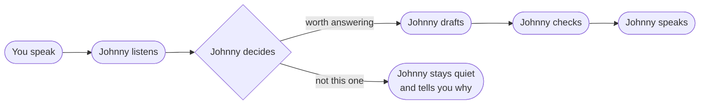

# What Johnny does between hearing you and speaking

A plain-language tour of how Johnny handles a single question in a meeting.
No code, no jargon. If you can set up a meeting in the UI, you can read this
in under ten minutes.

## The journey of a single question

You ask a question in the meeting. Johnny hears it, decides whether it should
answer, drafts an answer with an AI model, double-checks that answer for
problems, and speaks it back. Each step is a chance for Johnny to decide "no,
do not answer this one" — and when that happens, Johnny tells you why.

Johnny is always listening. As people talk, it quietly turns the speech into
written text. It does this for everyone, all the time, even in a mode where it
will never speak. That written version of what was said is what every later
step works from.

Once Johnny has a finished sentence from you, it makes a judgment call: is this
aimed at me, and is it worth a reply? Most talk in a meeting is not for the
bot. Johnny tries to speak only when speaking actually helps, and stays out of
the way the rest of the time.

If Johnny decides to answer, it asks an AI model to write the reply. The model
is given the recent conversation, your meeting notes, any calendar details, and
the instructions you wrote about how Johnny should behave. The draft that comes
back is a suggestion, not the final word.

Before anything is spoken, Johnny double-checks that draft. Is speaking even
allowed in this mode? Did the model actually return words? Can the voice be
produced right now? Did you just start talking again? Any one of these can stop
the reply before it reaches your ears.

If the draft passes every check, Johnny speaks it out loud in the meeting,
using the voice you chose. The very same words appear in the chat, so you can
always read back exactly what Johnny said.

And at every step, the answer can be "no". A turn can be background noise, not
meant for Johnny, or blocked by one of the checks. Whatever happens, the turn
never just vanishes — Johnny records the outcome, and when it stays quiet, it
records the reason too.

## The simple schematic

Read it left to right. Most turns flow along the top row, from hearing you to
speaking. When Johnny decides a turn is not for it, the path drops down to
"stays quiet" — and the reason is always recorded. A few of the later checks
can also end in "stays quiet"; you are told why in exactly the same way.

## The three things Johnny can do at each turn

Every turn you speak ends in exactly one of three outcomes, and you can always
tell which one happened.

1. **Johnny answered you.**
   - What you see: a spoken line from Johnny in the chat, marked **Replied**.
   - When to expect it: whenever Johnny is allowed to speak and decides your
     turn is worth a reply.

2. **Johnny drafted an answer and is waiting for you to approve it.**
   - What you see: a draft marked **Awaiting approval**, with an Approve button.
   - When to expect it: in Approval required mode, where nothing is spoken
     until you click Approve.

3. **Johnny chose not to answer this one.**
   - What you see: a line marked **No reply**, with a short reason such as
     "filtered as background noise".
   - When to expect it: when the turn was not aimed at Johnny, was background
     noise, the mode forbids speaking, or one of the checks blocked it.

The labels in the chat — **Replied**, **Awaiting approval**, **No reply** —
match these three outcomes exactly.

## The modes Johnny can be in

You pick a mode when you set up a meeting or save a template. The mode decides
how far Johnny is allowed to go on its own.

- **Listen only** — Johnny writes everything down and never speaks. Use it to
  capture a transcript with zero risk of interrupting.
- **Suggest only** — Johnny drafts replies in the UI; you read them and decide
  whether to say them yourself. Nothing is spoken automatically.
- **Approval required** — Johnny drafts a reply, then waits for you to click
  Approve before speaking it. Use it when you want a human check on every word.
- **Limited auto-speak** — Johnny speaks on its own, but only using replies
  from a fixed list you set in advance. Safe automation on a tight leash.
- **Autonomous** — Johnny speaks freely, guided only by the instructions you
  wrote. No approval step and no fixed list. Use it when you trust Johnny to
  carry the conversation.

## Where things can go wrong (and how the UI tells you)

The old problem was silence. You would ask something and Johnny would simply
not answer — no reply, no error, no reason. That is fixed. Every turn now ends
visibly, and when Johnny stays quiet the chat tells you **why**, in plain
words. Reasons you might see include:

- **"router decided not to respond"** — Johnny judged the turn was not aimed at
  it.
- **"below the confidence threshold"** — Johnny was not sure enough it heard you
  correctly.
- **"filtered as background noise"** — what it heard looked like noise, not a
  real question.
- **"you started speaking again"** — Johnny gave you the floor instead of
  talking over you.
- **"text-to-speech unavailable"** — Johnny had an answer but could not voice it
  right then.
- **"a processing step failed"** — something broke mid-turn. The turn is still
  recorded, not lost.

When you want the full story of any turn — whether it just happened or it was
days ago — open the session and expand its **reasoning timeline**. It walks you
through what Johnny heard, how it understood your turn, what context it looked
at, what it asked the AI model, what the model answered, which checks fired, and
what it finally did. Each step shows how long it took. Nothing is hidden and
nothing is invented: if a step did not happen, the timeline says so plainly.

So when Johnny stays silent, you have two places to look: the **No reply** line
in the chat for the short reason, and the **reasoning timeline** on the session
page for the full step-by-step story.

## For the curious: read on

This page is the friendly tour. The full technical reference — every component,
every event, the per-turn record, and the state machine behind the three
outcomes — lives in its companion:

**→ [docs/PIPELINE.md](PIPELINE.md)** — the engineer-facing deep-dive.
