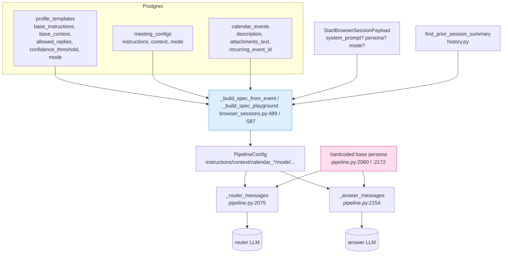
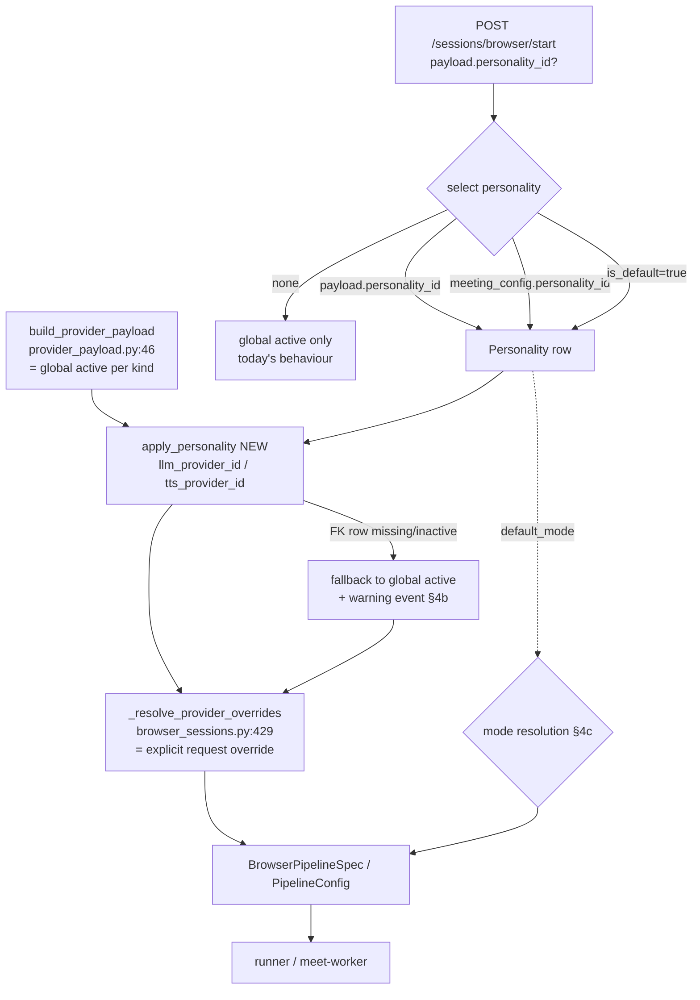

# PRD: Personality library (named provider + voice + mode presets)

> Parent epic: **Johnny-oly**. This document is the design pass (sub-task **Johnny-oly.1**).
> Nothing downstream (.2/.3/.4/.5/.6) starts until the operator signs off on
> **§4 Override resolution rules** and **§5 UI placement**.

## Context

A **personality** is a named, reusable preset that decides *which brain and which
voice* Johnny uses for a session, plus a default decision mode — nothing more.
Concretely it bundles:

- an **LLM provider** override (which `provider_credentials` row of `kind='llm'`),
- a **TTS provider** override (which `provider_credentials` row of `kind='tts'`),
- a **default mode** (`BotMode`), and
- a `metadata` JSONB bag for forward-compat (per-personality voice tuning, etc.).

It is **not** a system-prompt / persona-text store. Prompt text already has a home
(see §1): `ProfileTemplate.base_instructions`, `MeetingConfig.instructions`, the
playground `system_prompt` field, and the calendar event description. Personalities
are an **orthogonal axis** to `ProfileTemplate`:

| Axis | Owns | Lives in |
| --- | --- | --- |
| `ProfileTemplate` (exists today) | *what to say / how to behave* — `base_instructions`, `base_context`, `allowed_replies`, `confidence_threshold`, `mode` | `profile_templates` (`models.py:251-266`) |
| **Personality** (this PRD) | *which LLM + which TTS + default mode* | new `personalities` table |

The two compose: a meeting can use template "Sales rehearsal" (prompt + allowlist)
*and* personality "Johnny on GPT-4o + ElevenLabs Rachel" (brain + voice). Keeping
them separate avoids duplicating prompt text into a second table and keeps the
existing prompt-assembly path (§1) untouched in v1.

This feature touches exactly two subsystems:

1. **System-prompt assembly** (§1) — established here as *context only*; v1
   personalities deliberately do **not** modify it.
2. **Per-session provider + mode resolution** (§2) — where personalities actually
   slot in.

## Goals

- Let the operator define named personalities in a `/personalities` library and
  attach one to a calendar meeting or a playground session, swapping the LLM and/or
  TTS provider and the default mode for that session **without** mutating the global
  `provider_credentials.is_active` rows.
- Ship a bootstrap "Johnny" personality on first migration that produces **zero
  behaviour change** for an operator who never opens the page.
- Make override resolution **reliable, not silent**: a personality that points at an
  unconfigured / deactivated / deleted provider falls back to the global active
  provider for that kind **and surfaces a one-line warning** in the session UI.
- Reuse existing conventions everywhere (Alembic CHECK-enum migrations, partial
  unique indexes, the `provider_credentials` CRUD + activate pattern, the SvelteKit
  list-plus-side-panel modal, the typed `request<T>()` API client).

## Non-goals

- **No prompt-text column on personalities in v1.** Prompt/persona text stays in
  templates + meeting instructions + playground `system_prompt`. (Open question
  §8.5 revisits a v2 "persona prompt" field.)
- **No change to the prompt-assembly code** in `pipeline.py` (`_router_messages` /
  `_answer_messages`). Personalities affect provider selection + mode, not the
  concatenated system prompt.
- **No new STT-provider override.** v1 covers LLM + TTS only (STT rarely carries
  "personality"; can be added later with the same FK pattern).
- **No personality export/import** in v1 (§8.3).
- **No per-Google-account default personality** in v1 — the default is global
  (§8.2).
- No auth/RBAC work; this rides the existing single-operator surface.

---

## 1. Where the system prompt lives today

**Finding: there is no DB-stored global "Johnny" system prompt.** The two base
persona strings are **hardcoded** in the pipeline, and everything else is assembled
per-session from template + meeting + calendar sources into `PipelineConfig`, then
concatenated at LLM-call time.

### 1a. Assembly into `PipelineConfig` (session start)

`backend/app/api/browser_sessions.py` builds a `BrowserPipelineSpec` (→
`PipelineConfig`) in two functions:

- `_build_spec_from_event(...)` — calendar rehearsal — `browser_sessions.py:489-584`
- `_build_spec_playground(...)` — freeform playground — `browser_sessions.py:587-639`

For a calendar event the instruction/context text is layered like this
(`browser_sessions.py:502-512`):

```python
base_instructions = template.base_instructions if template is not None else ""
base_context     = template.base_context      if template is not None else ""
effective_instructions = "\n\n".join(p for p in (base_instructions, meeting.instructions) if p)
if payload.system_prompt:                 # explicit per-start override wins
    effective_instructions = payload.system_prompt
effective_context = "\n\n".join(p for p in (base_context, meeting.context) if p)
```

For playground there is a literal fallback persona (`browser_sessions.py:592-597`,
constant `DEFAULT_PERSONA = "Friendly conversation partner. Be concise."` at
`browser_sessions.py:92`):

```python
persona = payload.persona or DEFAULT_PERSONA
instructions = payload.system_prompt or f"You are a helpful assistant in playground mode. Persona: {persona}"
```

### 1b. Final concatenation at LLM call

The actual system message is built inside the pipeline, **not** in the API:

- Router stage — `VoicePipeline._router_messages` — `pipeline.py:2075-2152`
- Answer stage — `VoicePipeline._answer_messages` — `pipeline.py:2154-2206`

Both start from a **hardcoded** base string and append the per-session fields in a
fixed order. Router base string (`pipeline.py:2080-2084`):

```python
system = ("You are the gating router for an AI meeting bot. Decide whether "
          "the bot should speak in response to the latest transcript. "
          "Reply as JSON matching the supplied schema.")
```

Answer base string (`pipeline.py:2172-2175`):

```python
system = ("You are an AI meeting participant. Produce a concise spoken "
          "reply to the latest transcript.")
```

### 1c. Every source of system-prompt text, in concatenation order

| # | Source | Carried by | Set at | Concatenated at |
| --- | --- | --- | --- | --- |
| 1 | Hardcoded base persona | string literal | — | `pipeline.py:2080` (router) / `2172` (answer) |
| 2 | Bot-vs-participant labelling note | string literal | — | `pipeline.py:2085-2091` / `2176-2183` |
| 3 | **Mode** | `PipelineConfig.mode` (`pipeline.py:448`) | mode resolution (§2c) | `pipeline.py:2092` (router only) |
| 4 | Confidence threshold | `PipelineConfig.confidence_threshold` | template/meeting | `pipeline.py:2093-2095` (router only) |
| 5 | **Meeting instructions** (= template `base_instructions` + meeting `instructions`, or `payload.system_prompt` override) | `PipelineConfig.instructions` (`pipeline.py:408`) | `browser_sessions.py:505-509` | `pipeline.py:2096-2097` / `2184-2185` |
| 6 | Context | `PipelineConfig.context` (`pipeline.py:409`) | `browser_sessions.py:510-512` | `pipeline.py:2098-2099` / `2186-2187` |
| 7 | Calendar event description | `PipelineConfig.calendar_context` (`pipeline.py:410`) | `browser_sessions.py:563` (= `event.description`) | `pipeline.py:2100-2101` / `2188-2189` |
| 8 | Linked-doc bodies (Johnny-4da) | `PipelineConfig.calendar_attachments_text` (`pipeline.py:418`) | `browser_sessions.py:564` (= `event.attachments_text`) | `pipeline.py:2102-2106` / `2190-2194` |
| 9 | Prior-occurrence summary (Johnny-dsy) | `PipelineConfig.prior_session_context` (`pipeline.py:434`) | `browser_sessions.py:540-550` (`find_prior_session_summary`) | `pipeline.py:2107-2110` / `2195-2198` |
| 10 | Router-suggested reply (answer only) | `RouterDecision.suggested_reply` | router stage | `pipeline.py:2199-2200` |
| 11 | Allowed-replies constraint | `PipelineConfig.allowed_replies` (`pipeline.py:446`) | template/meeting | `pipeline.py:2111-2115` / `2201-2205` |

### 1d. Diagram — system-prompt assembly (today)



**Implication for personalities:** prompt text is fully determined by
templates/meeting/calendar/request. v1 personalities leave this path **untouched**;
they only change *which provider instances* stages 2-11 run against, and the `mode`
value (stage 3). If a future version wants personality-scoped prompt text, the only
edit point is `PipelineConfig.instructions` in the two spec builders — noted in
§8.5, out of scope here.

---

## 2. Where the active provider per kind lives today

**Correction to the bead's premise.** The bead names
`backend/app/providers/loader.py:load_active_providers` as the resolution point.
That function (`loader.py:42-75`) is **not called in any production path** — a repo
search finds it only in `backend/tests/providers/test_base.py` and in docstrings
(`pipeline.py:7`, `base.py:8,432`, `providers/__init__.py:8`). It is the ABC-level
loader kept importable for the SQLAlchemy-free meet-worker surface and unit tests.

The **live** per-session provider seam is `build_provider_payload`
(`backend/app/services/provider_payload.py:46-81`), which reads every
`provider_credentials` row where `is_active IS TRUE` and emits
`{kind: {provider_name, display_name, credentials, options}}`. Per-start overrides
are then layered by `_resolve_provider_overrides` (`browser_sessions.py:429-486`).

### 2a. Every production callsite of provider resolution

| Callsite | File:line | Path | Notes |
| --- | --- | --- | --- |
| `_build_spec_from_event` | `browser_sessions.py:518` | in-browser rehearsal | `build_provider_payload(session, get_crypto())` then `_resolve_provider_overrides` at `:525-527` |
| `_build_spec_playground` | `browser_sessions.py:603` | in-browser playground | same pair, overrides at `:610-612` |
| `enqueue/scheduler launch` | `session_scheduler.py:388` | scheduled real meeting (meet-worker) | `build_provider_payload(...)` → serialised into `JOHNNY_PROVIDER_CONFIG` env for the meet-worker container |
| `providers.py` test/sample | `providers.py:621` | catalog smoke calls | uses `resolve_pipeline_mode`; provider instantiated ad hoc |
| meet-worker rebuild | `meet_worker/pipeline_runner.py:214,299` | inside meet-worker | rebuilds providers from the JSON payload via `ProviderRegistry.instantiate` (no DB) |

The meet-worker is intentionally DB-free (`provider_payload.py:1-29`): the API
serialises the resolved payload and injects it as an env var, so **any
personality-driven override must be applied API-side, before serialisation** — i.e.
at the three `build_provider_payload` callsites above, never inside the meet-worker.

### 2b. Where a session-scoped provider override slots in

`_resolve_provider_overrides` (`browser_sessions.py:429-486`) already demonstrates
the exact merge contract we need: it takes `base_payload` (global active) and
returns a per-session `merged` dict **without mutating** the DB rows (`:443`). A
personality is a *second* override layer, resolved **between** global-active and the
explicit request override:

```
global active (build_provider_payload)
  └─ personality FKs (NEW: apply_personality)        ← personality.llm_provider_id / tts_provider_id
       └─ explicit request override (_resolve_provider_overrides)   ← payload.provider_overrides
```

**Recommended implementation seam:** a new pure resolver
`app/services/personality_resolver.py::apply_personality(session, base_payload, personality) -> (payload, warnings)`
called in both spec builders immediately after `build_provider_payload` and
*before* `_resolve_provider_overrides`. It looks up the personality's
`llm_provider_id` / `tts_provider_id` rows, decrypts via the existing
`decrypt_json(get_crypto(), row.credentials_encrypted)` path (mirroring
`browser_sessions.py:473-485`), overwrites `payload['llm']` / `payload['tts']`, and
returns any fallback warnings (§4b). The scheduler callsite
(`session_scheduler.py:388`) gets the same one-line insertion.

### 2c. Mode resolution today (the other thing personalities touch)

- Calendar event: `mode = payload.mode or meeting.mode or "free_auto_speak"`
  (`browser_sessions.py:529-533`). **`meeting.mode` is `NOT NULL`**
  (`models.py:288`), so for a real meeting the middle term is always present.
- Playground: `mode = payload.mode or BotMode.FREE_AUTO_SPEAK.value`
  (`browser_sessions.py:598`).
- `BotMode` enum (`models.py:46-63`): `listen_only`, `suggest_only`,
  `approval_required`, `limited_auto_speak`, `free_auto_speak`, `autonomous`.
- There is **no global "default mode" setting row** — the fallback is the hardcoded
  `free_auto_speak`. (`PipelineSettings` only stores `pipeline_mode` split/unified,
  `models.py:564-594` — a different axis.)

This non-null fact drives the precedence decision in §4c.

---

## 3. Proposed personality data model

New table **`personalities`**, mirroring `ProviderCredential` / `ProfileTemplate`
conventions (integer PK, `TimestampMixin`, `native_enum=False` CHECK enums,
`_json_column()` for JSONB, partial unique index for the singleton flag).

### 3a. Columns

| Column | Type | Nullable | Default | Intent |
| --- | --- | --- | --- | --- |
| `id` | `Integer` PK autoincrement | no | — | surrogate key (integer, **not** UUID — matches every other table, e.g. `models.py:546`) |
| `display_name` | `String(128)` | no | — | unique human label shown in dropdowns; mirrors `profile_templates.name` (`models.py:255`) |
| `description` | `Text` | yes | `NULL` | free-text "what this personality is for"; UI helper text only |
| `is_default` | `Boolean` | no | `false` | exactly one row may be `true` (partial unique index); the session-start fallback personality |
| `llm_provider_id` | `Integer` FK → `provider_credentials.id` | yes | `NULL` | when set, overrides the global active LLM for the session; `NULL` = inherit global active |
| `tts_provider_id` | `Integer` FK → `provider_credentials.id` | yes | `NULL` | when set, overrides the global active TTS; `NULL` = inherit global active |
| `default_mode` | `BotMode` (VARCHAR(32) + CHECK) | yes | `NULL` | personality's preferred decision mode; `NULL` = inherit (see §4c precedence) |
| `metadata` | `JSON`/`JSONB` (`_json_column()`) | no | `{}` | forward-compat bag: per-personality voice tuning (`{"tts_options": {...}}`), future knobs. v1 **stores** it; consumption is §8.6 |
| `created_at` | `DateTime(tz=True)` | no | `func.now()` | via `TimestampMixin` (`models.py:130-143`) |
| `updated_at` | `DateTime(tz=True)` | no | `func.now()` / `onupdate` | via `TimestampMixin` |

> Note: the ORM attribute cannot literally be named `metadata` (reserved on
> SQLAlchemy's declarative `Base`). Use attribute `extra_metadata` mapped to DB
> column `metadata` (`mapped_column("metadata", _json_column(), ...)`), or name the
> column `personality_metadata`. Recommend **column `metadata`, attribute
> `extra_metadata`** so the JSON wire/db name stays clean.

### 3b. Constraints & indexes

- `UniqueConstraint("display_name", name="uq_personalities_display_name")` — mirrors
  `profile_templates.name` uniqueness.
- Partial unique index enforcing the single default, mirroring the active-per-kind
  index (`models.py:537-543`, migration `0002_provider_active_unique.py:21-27`):
  ```python
  Index("uq_personalities_single_default", "is_default", unique=True,
        postgresql_where=text("is_default"), sqlite_where=text("is_default"))
  ```
  Only `is_default=true` rows are indexed; they all share value `true`, so at most
  one can exist.
- FKs `llm_provider_id` / `tts_provider_id` → `provider_credentials.id` with
  **`ondelete="SET NULL"`** (rationale + alternative in §4b/§8.1).
- `default_mode` CHECK via the existing `_in_list("default_mode", BOT_MODES)` helper
  pattern (migration `0009_pipeline_settings.py:38-40, 84-87`).

### 3c. SQLAlchemy model sketch (mirrors `models.py` conventions)

```python
class Personality(TimestampMixin, Base):
    __tablename__ = "personalities"
    __table_args__ = (
        UniqueConstraint("display_name", name="uq_personalities_display_name"),
        Index("uq_personalities_single_default", "is_default", unique=True,
              postgresql_where=text("is_default"), sqlite_where=text("is_default")),
    )
    id: Mapped[int] = mapped_column(Integer, primary_key=True, autoincrement=True)
    display_name: Mapped[str] = mapped_column(String(128), nullable=False)
    description: Mapped[str | None] = mapped_column(Text, nullable=True)
    is_default: Mapped[bool] = mapped_column(Boolean, nullable=False, default=False)
    llm_provider_id: Mapped[int | None] = mapped_column(
        ForeignKey("provider_credentials.id", ondelete="SET NULL"), nullable=True)
    tts_provider_id: Mapped[int | None] = mapped_column(
        ForeignKey("provider_credentials.id", ondelete="SET NULL"), nullable=True)
    default_mode: Mapped[BotMode | None] = mapped_column(_bot_mode_column(), nullable=True)
    extra_metadata: Mapped[dict[str, Any]] = mapped_column(
        "metadata", _json_column(), nullable=False, default=dict)
```

(`_bot_mode_column()` is `models.py:119-127`; `_json_column()` is the existing JSON
helper used at e.g. `models.py:201,260`; `_str_enum_values` at `models.py:112-116`.)

---

## 4. Override resolution rules

Resolved once, **API-side, at session start**, inside the spec builders
(`browser_sessions.py:489/587`) and the scheduler (`session_scheduler.py:388`).
Personalities never mutate `provider_credentials`; they only shape the per-session
payload + mode.

### 4a. Which personality applies (selection precedence)

1. `payload.personality_id` (NEW request field) — explicit this-start choice.
2. For a calendar meeting: `meeting_config.personality_id` (NEW nullable FK on
   `meeting_configs`).
3. The `is_default=true` personality (bootstrap "Johnny").
4. If somehow none exists (default row deleted): behave exactly like today (pure
   global active, mode fallback) — never hard-fail a session over a missing
   personality.

### 4b. Provider override precedence (per kind: llm, tts)

| Priority | Source | Applies when |
| --- | --- | --- |
| 1 (highest) | `payload.provider_overrides[kind]` (`_resolve_provider_overrides`, `browser_sessions.py:429`) | operator explicitly overrode this start |
| 2 | `personality.{llm,tts}_provider_id` | FK set **and** the row exists **and** decrypts |
| 3 | global active row (`build_provider_payload`, `provider_payload.py:46`) | otherwise |
| 4 | absent | no active row for that kind → channel disabled (today's behaviour, e.g. no TTS ⇒ degrade to suggest-only, `pipeline.py:300-308`) |

**Fallback rule (operator must ratify).** If a personality's
`llm_provider_id`/`tts_provider_id` points at a row that is **missing, deactivated,
or fails to decrypt**, the resolver **falls back to the global active provider for
that kind AND emits a one-line warning** surfaced in the session UI — it never
fails the session silently and never hard-errors.

- *Recommendation:* fall-back-and-warn. *Reason:* the operator's stated priority is
  reliability; a meeting must not die because a personality references a provider the
  operator later turned off. Silent fallback, by contrast, would hide a
  misconfiguration the operator needs to fix.
- *Warning mechanism:* `apply_personality` returns a `warnings: list[str]`; the spec
  builder publishes them as a session event on the existing event bus (sibling to
  `PipelineStageFailed` / `AgentTTSFailed` in `johnny/voice_pipeline/events.py`),
  rendered in the activity log and as a chip/toast on the running-session card
  (§5d). Also `logger.warning("personality %s: llm_provider_id=%s unusable (%s); "
  "falling back to global active", ...)` for `docker logs api`.

### 4c. Mode override precedence + interaction with the calendar per-meeting mode

Because `meeting_configs.mode` is `NOT NULL` (`models.py:288`), a real meeting
*always* has an explicit mode. Recommended precedence (most specific wins):

| Priority | Source | Calendar meeting | Playground |
| --- | --- | --- | --- |
| 1 | `payload.mode` (this-start override) | ✅ `browser_sessions.py:530` | ✅ `:598` |
| 2 | `meeting_config.mode` (per-meeting saved choice, Johnny-ckz) | ✅ `:531` | n/a |
| 3 | `personality.default_mode` | only as the **seed** when a *new* `meeting_config` is created with a personality selected (sets the initial `meeting.mode`); does **not** override an existing meeting's mode | ✅ fills the playground default |
| 4 | hardcoded `free_auto_speak` | ✅ `:532` | ✅ `:598` |

- *Recommendation:* **the per-meeting `meeting.mode` wins over
  `personality.default_mode`.** *Reason:* the per-meeting mode is the more specific,
  deliberate choice (Johnny-ckz shipped it precisely so an operator can pin a meeting
  to e.g. `listen_only`); letting a personality silently flip a configured meeting to
  `autonomous` is a footgun. So `personality.default_mode` behaves as a **default
  that seeds new meetings and fills the playground**, not as an override of an
  existing per-meeting mode. (This is a slight narrowing of the bead's "overrides
  meeting/playground default mode" wording — flagged for ratification in §8.4.)

### 4d. Default personality semantics

- Invariant: **exactly one** personality has `is_default=true` at any time (partial
  unique index, §3b). Setting a new default flips the old one off in the same
  transaction — mirror `providers.py`'s `activate_provider` / `_activate_kind`
  (`providers_seed.py` deactivate-siblings pattern).
- Bootstrap migration sets "Johnny" as the default (§6).
- Deleting the default is blocked by the API (must promote another first), so the
  selection chain in §4a always terminates.

### 4e. Diagram — resolution at session start



---

## 5. UI placement decisions

All four surfaces reuse existing patterns; the typed API client mirrors
`frontend/src/lib/providers.ts` / `sessions.ts` (`request<T>()` wrapper).

### 5a. New `/personalities` library route — *why here*

`frontend/src/routes/personalities/+page.svelte`, a near-clone of
`frontend/src/routes/providers/+page.svelte` (list + right-side-panel modal; modal
markup `providers/+page.svelte:1439-1571`; `openModalForEdit` `:304`). *Justification:*
a personality is operator-managed config with the same lifecycle as a provider
(list → create/edit in a side panel → set-default ≈ activate → delete). Cloning the
providers page gives consistent affordances (active/default badge, side panel,
delete confirm) for free, and slots alphabetically beside `/providers` in the nav.

### 5b. Personality dropdown on the calendar event detail panel — *why here*

`frontend/src/routes/calendar/+page.svelte`, inserted **above** the existing Mode
`<select>` (`calendar/+page.svelte:956-978`, `data-testid="mode-select"`), after the
identity section. *Justification:* the meeting detail panel is already where
per-meeting *mode* (Johnny-ckz) and template are chosen; personality is the same
class of per-meeting decision (which brain/voice this meeting uses) and belongs in
the same panel. Placing it above Mode signals that the personality can *seed* the
mode (§4c). Writes `meeting_config.personality_id` via the existing meeting-config
save path (`frontend/src/lib/meetingConfigs.ts`).

### 5c. Personality dropdown above the playground prompt textarea — *why here*

`frontend/src/lib/components/playground/SetupForm.svelte`, inserted **above** the
"System prompt" textarea (`SetupForm.svelte:131-143`,
`data-testid="playground-system-prompt"`), near the existing Persona field
(`:89-103`). *Justification:* the operator composes a playground run top-down
(brain/voice → prompt → start); choosing the personality first (which LLM + voice)
before writing the prompt matches that flow, and keeps the personality visually
distinct from the free-text persona/prompt it complements (not replaces). Sends a
new `personality_id` field on `POST /sessions/browser/start`.

### 5d. "Active personality" badge on the running-session card — *why here*

`frontend/src/lib/components/playground/LiveSession.svelte`, as an extra chip in the
existing chip row (`LiveSession.svelte:137-149`; chips built at `:37-89`, same shape
as the provider chips at `:61-82`). *Justification:* the card already advertises
Mode / Pipeline / Template / Providers as chips; the personality is the missing
"which preset is live" signal, and a chip is the established idiom. This chip is also
where the §4b fallback warning surfaces (e.g. a warning-styled "Personality: Johnny
(TTS fell back)" chip or adjacent toast).

### 5e. API client + backend endpoints

- Frontend: new `frontend/src/lib/personalities.ts` — typed `Personality` interface
  + `listPersonalities` / `getPersonality` / `createPersonality` /
  `updatePersonality` / `deletePersonality` / `setDefaultPersonality`, copying the
  `request<T>()` wrapper from `providers.ts`.
- Backend: new `backend/app/api/personalities.py` — `APIRouter(prefix="/personalities")`
  with list / create / update / delete + `POST /personalities/{id}/default`,
  mirroring `providers.py`'s structure (`providers.py:1-90`, CRUD + activate). The
  set-default endpoint runs the deactivate-siblings-then-flip transaction (§4d).
- Register the router in `backend/app/main.py` alongside the existing includes
  (`main.py:125-139`, beside `providers_router` at `:134`):
  `app.include_router(personalities_router)`.

---

## 6. Migration plan

New revision **`0014_personalities.py`** (latest is
`0013_cross_session_continuity.py`; `down_revision = "0013"`), shaped exactly like
`0009_pipeline_settings.py` (idempotent `op.create_table`, CHECK-enum via `_in_list`,
`server_default=sa.func.now()` timestamps, `op.execute` seed) and using the partial
unique index from `0002_provider_active_unique.py:21-27`.

### 6a. Bootstrap "Johnny" with **NULL** FKs — and why NULL beats copying ids

Seed one row at migration time:

```python
op.execute("""
    INSERT INTO personalities
        (display_name, description, is_default, llm_provider_id, tts_provider_id,
         default_mode, metadata, created_at, updated_at)
    SELECT 'Johnny', 'Default personality (inherits the globally active providers).',
           TRUE, NULL, NULL, NULL, '{}', NOW(), NOW()
    WHERE NOT EXISTS (SELECT 1 FROM personalities WHERE is_default IS TRUE)
""")
```

**Decision: the bootstrap default carries `NULL` provider FKs and `NULL`
`default_mode`, i.e. "inherit the global active providers and the existing mode
resolution."** This is what delivers literal **zero behaviour change**: per §4b/§4c,
`NULL` FKs fall through to `build_provider_payload` (unchanged) and `NULL`
`default_mode` falls through to `meeting.mode` / `free_auto_speak` (unchanged). An
operator who never opens `/personalities` gets byte-identical session specs.

*Why NULL rather than copying today's active provider ids into the FKs* (the bead's
"which provider row gets copied where" framing): copying would **pin** Johnny to a
snapshot of whatever is active at migration time. The moment the operator later
activates a different LLM/TTS in Settings → Providers, the pinned Johnny personality
would silently diverge from "the active provider" — a surprising regression. `NULL`
= "always follow whatever is active" is both simpler and matches the operator's
mental model of the default. (It is also order-independent: on a fresh DB the
migration runs *before* `seed_providers_from_file` in the lifespan, `main.py:48` vs
`:62-65`, so there are no active rows to copy yet anyway.)

If the operator explicitly wants snapshot-pinning instead, the alternative is a
lifespan `seed_default_personality(session)` hook added after
`seed_providers_from_file` (`main.py:65`) that reads the active llm/tts ids and
writes them into the FKs — documented but **not recommended** (§8.4 adjacent).

### 6b. `meeting_configs.personality_id`

Same migration adds a nullable FK column
`meeting_configs.personality_id → personalities.id ON DELETE SET NULL` (mirrors the
nullable-FK adds in `0007` / `0012`). `NULL` = "use the default personality / no
per-meeting personality", so existing meetings are unaffected.

### 6c. Drift guard

`app/db/bootstrap.py:check_model_db_drift` (`:78-106`) will fail boot if the ORM
model and migration disagree — so the `Personality` model + `0014` must land
together. No extra work, just a reminder for sub-task .2.

---

## 7. Test plan outline

*Outline only — the tests themselves are sub-tasks .2–.6.*

### 7a. Backend unit / integration

| File | Covers |
| --- | --- |
| `backend/tests/api/test_personalities.py` (new) | CRUD; `display_name` uniqueness (409); set-default flips the previous default (single-`is_default` invariant); cannot delete the default; FK `SET NULL` on provider delete |
| `backend/tests/services/test_personality_resolver.py` (new) | `apply_personality` precedence (request > personality > global); fallback-on-missing/inactive/undecryptable FK returns warning + global active; `NULL` FKs are a no-op |
| `backend/tests/api/test_browser_sessions.py` (extend) | start with `personality_id` ⇒ effective `provider_payload` reflects the personality's llm/tts; personality with a dead FK ⇒ session still starts + warning event emitted; mode precedence (§4c) for event vs playground |
| `backend/tests/db/test_bootstrap_personalities.py` (new) | after `0014`, exactly one `is_default` "Johnny" with `NULL` FKs/mode exists; rerunning the seed is idempotent; a session built with the bootstrap default produces a spec byte-identical to the pre-migration spec (zero-behaviour-change proof) |
| `backend/tests/services/test_session_scheduler.py` (extend) | scheduled meet-worker launch (`session_scheduler.py:388`) applies the meeting's personality before serialising `JOHNNY_PROVIDER_CONFIG` |

### 7b. chrome-devtools MCP scenarios (the matrix sub-task .6 must cover)

1. `/personalities` CRUD: create, edit, delete; assert list + side-panel modal.
2. Single-default invariant: set personality B default; assert A's default badge
   clears and B's lights up; assert delete-default is blocked.
3. Calendar event detail: pick a personality above Mode; start a session; assert the
   effective provider/mode via network capture + the live chips.
4. Playground: pick a personality above the prompt textarea; start; assert effective
   provider/voice.
5. Running-session card: assert the active-personality chip renders.
6. Fallback warning: point a personality's TTS FK at a deactivated provider; start;
   assert the session still starts **and** the fallback warning chip/toast shows.

All artifacts under `.validation/Johnny-oly/NN-*.png` per the project rule.

---

## 8. Open questions for the operator (each with a recommended answer)

**8.1 — Deleted provider row referenced by a personality: `SET NULL` vs cascade-block.**
*Recommend `ON DELETE SET NULL`.* The personality survives with a `NULL` FK and
transparently inherits global active + warns (§4b) — consistent with the
deactivation fallback. `RESTRICT` (the precedent at `meeting_configs.profile_template_id`,
`models.py:281`) would block the operator from deleting a provider any personality
references, which is surprising and annoying for a soft preference. (Personalities
differ from meeting_configs: a personality with a null provider FK is still valid and
useful; a meeting_config with a null template is not.)

**8.2 — Multi-account bots (Johnny-al3): per-account default personality or global?**
*Recommend a single global default for v1* (one `is_default` row). Per-account
defaults would need a `google_accounts.default_personality_id` (or a join table) and
a fourth selection layer in §4a — real complexity for unclear value while the bot
fleet is small. Revisit in v2 if operators run distinct personas per bot identity.

**8.3 — Personality export/import in v1 or v2?** *Recommend v2.* The table is tiny
and operator-managed; there is no sharing/portability need yet, and the providers
surface has no export today either. Defer until there's a concrete "move
personalities between deployments" ask.

**8.4 — Ratify the mode precedence (§4c): per-meeting `meeting.mode` wins over
`personality.default_mode`.** *Recommend yes.* `meeting.mode` is non-null and is the
deliberate per-meeting choice from Johnny-ckz; `personality.default_mode` acts as a
seed for new meetings + the playground default, not an override of a configured
meeting. This is a slight narrowing of the bead's wording and needs an explicit
thumbs-up because it changes what "overrides … default mode" means.

**8.5 — Should a personality carry its own prompt/persona text in v1?** *Recommend
no.* Prompt text lives in templates + meeting instructions + playground
`system_prompt` (§1); duplicating it onto personalities creates a second precedence
problem and overlaps `ProfileTemplate`. v1 personality = brain + voice + default
mode. If users later want one-click "voice + persona prompt" bundles, add a nullable
`base_instructions` column and inject it into `PipelineConfig.instructions` at the
single seam noted in §1d — a clean v2 follow-up.

**8.6 — Does `metadata` feed TTS voice-tuning in v1, or just store?** *Recommend
store-only in v1* (schema present, `apply_personality` ignores it) and consume in v2
by merging `metadata.get("tts_options", {})` into the resolved TTS payload's
`options`. Keeps v1's blast radius to provider-row selection + mode, with the
forward-compat column already in place so no migration is needed to light it up.

---

## Acceptance criteria (for this design pass)

- This PRD lives at `tasks/prd-personality-library.md` with §1–§8 filled in with
  concrete references (file paths, function names, line numbers, table columns) —
  no hand-waving. ✅
- Two Mermaid diagrams: system-prompt assembly (§1d) and override resolution (§4e). ✅
- Every open question (§8) has a recommended answer with reasoning. ✅
- The operator reviews and signs off on **§4 (override resolution rules)** and **§5
  (UI placement)** before sub-tasks .2/.3/.4/.5/.6 begin. ⬜ (operator action)

## Out of scope

Code. This is design + PRD only; implementation lives in the other Johnny-oly
sub-tasks. The `load_active_providers` ABC loader, the meet-worker's DB-free
rebuild, and the prompt-assembly strings in `pipeline.py` are documented here as
context but are **not** modified by the personality feature in v1.
